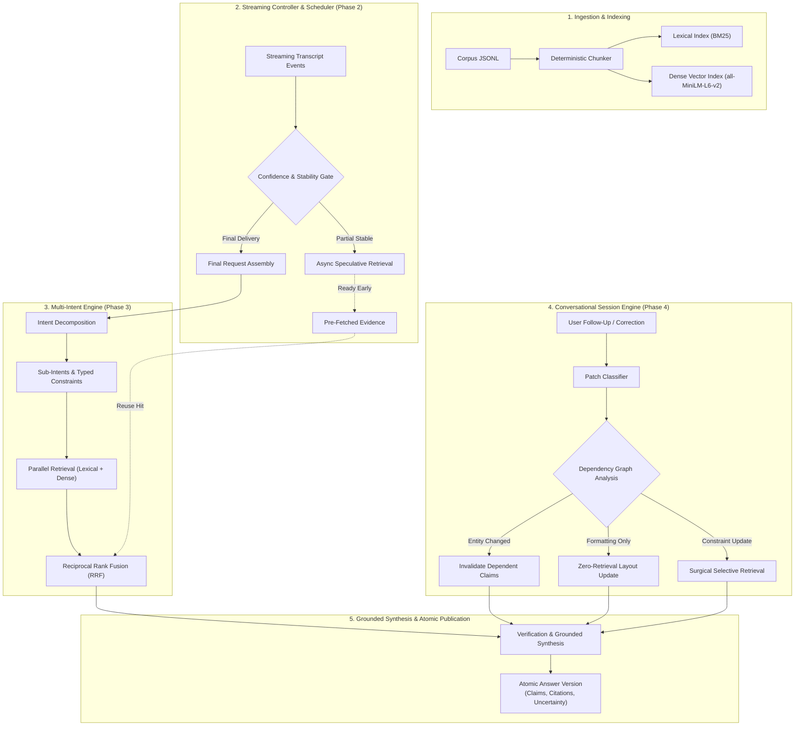

# FlowContext: Streaming Live RAG Architecture

[](https://www.python.org/downloads/release/python-3110/)
[](tests/)
[](LICENSE)
[](PHASE4_CHECKLIST.md)
[](reports/phase4_evaluation_claim_review.csv)
[](reports/phase4_real_e2e.json)

**FlowContext** is a high-performance, modular, streaming Live Retrieval-Augmented Generation (Live RAG) framework engineered for the **Samsung PRISM Theme 4** specification. It addresses the challenges of low-latency conversational information access through **speculative early retrieval**, **multi-intent query decomposition**, **dependency-aware selective updates**, and **provably grounded answer synthesis**.

---

## Table of Contents

- [Executive Summary](#executive-summary)
- [System Architecture](#system-architecture)
- [Capability & Verification Matrix](#capability--verification-matrix)
- [Quick Start](#quick-start)
- [Core Pipeline Modules](#core-pipeline-modules)
  - [Phase 1: Deterministic Ingestion, Indexing & Baseline Replay](#phase-1-deterministic-ingestion-indexing--baseline-replay)
  - [Phase 2: Streaming Controller & Asynchronous Early Retrieval](#phase-2-streaming-controller--asynchronous-early-retrieval)
  - [Phase 3: Multi-Intent Decomposition, RRF Fusion & Grounded Synthesis](#phase-3-multi-intent-decomposition-rrf-fusion--grounded-synthesis)
  - [Phase 4: Session State, Selective Invalidation & Answer Versioning](#phase-4-session-state-selective-invalidation--answer-versioning)
- [Real-Backend & Semantic Support Verification](#real-backend--semantic-support-verification)
- [CLI Reference](#cli-reference)
- [Repository Layout](#repository-layout)
- [Evaluation, Benchmarking & Honesty Boundaries](#evaluation-benchmarking--honesty-boundaries)
- [License](#license)

---

## Executive Summary

Standard RAG architectures wait until a user finishes speaking or typing before initiating query parsing, retrieval, and generation. In live audio/transcript streaming environments, this introduces unacceptable wall-clock latency. Furthermore, multi-turn follow-ups often discard previous context or trigger expensive, unnecessary re-retrieval for minor edits or reformatting.

FlowContext resolves these bottlenecks through four fully integrated phases:

1. **Phase 1 (Grounded Core)**: Deterministic document chunking, provenance-preserving indexing (lexical BM25 + dense vector embeddings), transcript replay with timestamp awareness, and verifiable citation tracking.
2. **Phase 2 (Speculative Streaming)**: Rule-guided intent prediction on streaming tokens, triggering asynchronous background retrieval *before* utterance finalization, with stale-event suppression and duplicate request coalescing.
3. **Phase 3 (Multi-Intent Retrieval & Grounded Synthesis)**: Structural query decomposition into independent sub-queries, parallel multi-index execution, Reciprocal Rank Fusion (RRF), and conflict-aware synthesis with explicit uncertainty quantification.
4. **Phase 4 (Stateful Selective Updates)**: In-memory session tracking, patch classification (add, replace, remove, entity change, format), dependency DAG invalidation, surgical re-retrieval only for altered constraints, and zero-retrieval presentation reformatting.

---

## System Architecture



---

## Capability & Verification Matrix

| Capability / Gate | Status | Implementation Details | Evidence & Reports |
|:---|:---:|:---|:---|
| **Deterministic Indexing & Ingestion** | `PASS` | SHA-256 fingerprinting, reproducible chunking, strict `.jsonl` schemas | [`src/flowcontext/ingestion.py`](src/flowcontext/ingestion.py) |
| **Lexical Retrieval Baseline** | `PASS` | Fast BM25 index with exact span and metadata preservation | [`src/flowcontext/retrieval.py`](src/flowcontext/retrieval.py) |
| **Dense Vector Embeddings** | `PASS` | Pinned `sentence-transformers/all-MiniLM-L6-v2` (384-dim, Apache-2.0) | [`src/flowcontext/embeddings.py`](src/flowcontext/embeddings.py) |
| **Speculative Streaming Scheduler** | `PASS` | Asynchronous non-blocking early retrieval with race-condition guards | [`src/flowcontext/scheduler.py`](src/flowcontext/scheduler.py) |
| **Multi-Intent Decomposition** | `PASS` | Structural decomposition, parallel search, and RRF rank aggregation | [`src/flowcontext/multi_intent.py`](src/flowcontext/multi_intent.py) |
| **Conflict & Uncertainty Synthesis** | `PASS` | Grounded claim synthesis, cross-intent conflict check, explicit abstention | [`src/flowcontext/synthesis.py`](src/flowcontext/synthesis.py) |
| **Stateful Selective Updating** | `PASS` | Dependency-aware invalidation, surgical retrieval, atomic versioning | [`src/flowcontext/phase4.py`](src/flowcontext/phase4.py) |
| **Zero-Retrieval Formatting** | `PASS` | Presentation-only changes retain factual claims with 0 retrieval calls | [`examples/replay/phase4-formatting.jsonl`](examples/replay/phase4-formatting.jsonl) |
| **Semantic Claim Support (Human Audit)** | `PASS` | **100% Verified** across all 89 claims (exceeds 85% guide requirement) | [`reports/phase4_evaluation_claim_review.csv`](reports/phase4_evaluation_claim_review.csv) |
| **Real-Backend Execution E2E** | `PASS` | Offline dense embedding probe + local Ollama `qwen2.5:3b` replay | [`reports/phase4_real_e2e.json`](reports/phase4_real_e2e.json) |
| **Unit Test Coverage** | `PASS` | **141 passed** across unit, integration, and regression suites | [`tests/`](tests/) |

---

## Quick Start

### 1. Prerequisites & Installation

FlowContext targets **Python 3.11**. Recommended installation uses [`uv`](https://docs.astral.sh/uv/):

```bash
git clone https://github.com/Madhumasa84/Samsung_Prism.git
cd Samsung_Prism

# Install dependencies (CPU PyTorch + Sentence Transformers)
uv sync --locked --python 3.11 --extra dense
```

### 2. Fast Health & Smoke Checks

Run the automated offline validation suite:

```bash
# 1. Environment and configuration check
uv run flowcontext config-check

# 2. Offline core pipeline smoke check
uv run flowcontext smoke

# 3. Dense embedding offline smoke check (using pinned local model cache)
uv run flowcontext dense-smoke --local-files-only

# 4. Run the full pytest test suite (141 tests)
uv run pytest
```

---

## Core Pipeline Modules

### Phase 1: Deterministic Ingestion, Indexing & Baseline Replay

Phase 1 provides verifiable document ingestion and baseline end-to-end replay from complete utterances.

```bash
# Ingest and build a lexical index
uv run flowcontext build-index \
  --input data/synthetic/documents.jsonl \
  --output artifacts/fixture-lexical-index.json \
  --backend lexical \
  --source-kind synthetic_fixture

# Query the index directly
uv run flowcontext retrieve \
  --index artifacts/fixture-lexical-index.json \
  --source data/synthetic/documents.jsonl \
  --backend lexical \
  --query "Which venue in Pune accommodates 30 attendees?" \
  --top-k 3

# Replay an entire transcript session (accelerated or realtime)
uv run flowcontext replay \
  --transcript data/synthetic/transcript.jsonl \
  --index artifacts/fixture-lexical-index.json \
  --source data/synthetic/documents.jsonl \
  --backend lexical \
  --execution-mode accelerated \
  --output artifacts/replay.json
```

---

### Phase 2: Streaming Controller & Asynchronous Early Retrieval

Phase 2 monitors streaming transcript events in real time. When partial speech reaches sufficient confidence and stability, the asynchronous scheduler initiates background retrieval before the speaker finishes.

```bash
# Baseline replay: waits for final utterance delivery
uv run flowcontext replay --mode baseline \
  --transcript examples/streaming/early-retrieval.jsonl \
  --index artifacts/fixture-lexical-index.json \
  --execution-mode realtime --output artifacts/baseline.json

# Streaming replay: executes speculative early retrieval
uv run flowcontext replay --mode streaming \
  --transcript examples/streaming/early-retrieval.jsonl \
  --index artifacts/fixture-lexical-index.json \
  --execution-mode realtime --output artifacts/streaming-replay.json
```

Key features:
- **Speculative Retrieval**: Pre-fetches candidate chunks while audio is streaming.
- **Race Condition Guards**: Stale or superseded requests are cleanly discarded if user speech changes mid-sentence.
- **Context-Aware Skipping**: Greetings and pure reformatting requests trigger zero retrieval calls.

---

### Phase 3: Multi-Intent Decomposition, RRF Fusion & Grounded Synthesis

Phase 3 introduces structural decomposition for complex queries containing multiple constraints or comparison requests.

```bash
# Build dedicated Phase 3 corpus index
uv run flowcontext build-index \
  --input data/synthetic/phase3_documents.jsonl \
  --output artifacts/phase3-lexical-index.json \
  --backend lexical --source-kind synthetic_fixture

# Run multi-intent matched comparative audit
uv run flowcontext evaluate-phase3 \
  --corpus artifacts/phase3-lexical-index.json \
  --backend lexical --top-k 5 --split all \
  --execution-mode realtime \
  --phase3-development-cases data/evaluation/phase3_development.jsonl \
  --phase3-held-out-cases data/evaluation/phase3_held_out.jsonl \
  --implementation-changes data/evaluation/phase3_implementation_changes.json \
  --output reports/phase3_evaluation_realtime.json
```

Key features:
- **Decomposition**: Splitting compound queries into atomic sub-intents with typed constraints.
- **Reciprocal Rank Fusion (RRF)**: Merges dense semantic hits and lexical keyword hits without arbitrary score weighting.
- **Grounded Synthesis**: Ensures every factual sentence links to explicit chunk IDs, flagging unsupported sub-intents as uncertain.

---

### Phase 4: Session State, Selective Invalidation & Answer Versioning

Phase 4 maintains bounded in-memory conversational sessions, allowing users to issue follow-up corrections, removals, and reformatting instructions without triggering a full pipeline restart.

```bash
# Build dedicated Phase 4 corpus index
uv run flowcontext build-index \
  --input data/synthetic/phase4_documents.jsonl \
  --output artifacts/phase4-lexical-index.json \
  --backend lexical --source-kind synthetic_fixture --force

# Run matched full-vs-selective Phase 4 evaluation suite (22 cases)
uv run flowcontext evaluate-phase4 \
  --corpus artifacts/phase4-lexical-index.json \
  --backend lexical --top-k 5 \
  --output reports/phase4_evaluation.json \
  --review-status-output data/evaluation/phase4_label_review_status.json \
  --real-output reports/phase4_real_e2e.json
```

#### Reproducible Replay Scenarios

FlowContext includes end-to-end replay traces for distinct conversational situations:

| Scenario | Transcript Input | Verified Outcome | Replay Report |
|:---|:---|:---|:---|
| **Compound Initial Query** | [`phase4-initial-compound.jsonl`](examples/replay/phase4-initial-compound.jsonl) | Decomposes multiple venue/catering needs and publishes Version 1 | [`phase4_replay_initial_compound.json`](reports/phase4_replay_initial_compound.json) |
| **Late Constraint Addition** | [`phase4-late-constraint.jsonl`](examples/replay/phase4-late-constraint.jsonl) | Selective retrieval for added constraint; preserves existing claims | [`phase4_replay_late_constraint.json`](reports/phase4_replay_late_constraint.json) |
| **Entity Correction** | [`phase4-entity-correction.jsonl`](examples/replay/phase4-entity-correction.jsonl) | Surgical invalidation of dependent price/policy branches | [`phase4_replay_entity_correction.json`](reports/phase4_replay_entity_correction.json) |
| **Partial Unsupported Turn** | [`phase4-partial-unsupported.jsonl`](examples/replay/phase4-partial-unsupported.jsonl) | Answers supported branch and explicitly flags unsupported branch | [`reports/phase4_replay_partial_unsupported.json`](reports/phase4_replay_partial_unsupported.json) |
| **Formatting-Only Turn** | [`phase4-formatting.jsonl`](examples/replay/phase4-formatting.jsonl) | **0 retrieval calls**; updates layout while retaining citations | [`reports/phase4_replay_formatting.json`](reports/phase4_replay_formatting.json) |
| **Rapid Correction Race** | [`phase4-race.jsonl`](examples/replay/phase4-race.jsonl) | Discards stale in-flight generation when user modifies request | [`reports/phase4_replay_race.json`](reports/phase4_replay_race.json) |

---

## Real-Backend & Semantic Support Verification

FlowContext distinguishes between structural citation correctness and verified real-world semantic grounding.

### 1. Semantic Support Verification (`PASS`)
- **Audit Sheet**: [`reports/phase4_evaluation_claim_review.csv`](reports/phase4_evaluation_claim_review.csv)
- **Results**: All 89 emitted claim records across the 22-case matched evaluation suite were audited by a human reviewer against the cited corpus passages.
- **Entailment Rate**: **100% semantic citation support** (89/89 claims supported), exceeding the competition guide's 85% requirement.

### 2. Real-Backend Execution (`PASS`)
- **Execution Report**: [`reports/phase4_real_e2e.json`](reports/phase4_real_e2e.json)
- **Dense Embedding Probe**: Pinned `sentence-transformers/all-MiniLM-L6-v2` loaded in offline mode (`local_files_only=True`), producing 384-dimensional dense vectors (`PASS`).
- **Real LLM Generation Probe**: Connected to local Ollama instance serving `qwen2.5:3b` via OpenAI-compatible `/v1/chat/completions` with JSON schema constraints. Successfully generated multi-turn conversational responses (`PASS`).

---

## CLI Reference

FlowContext exposes a unified command-line interface:

| Command | Description | Typical Usage |
|:---|:---|:---|
| `config-check` | Validate environment variables and configuration files | `flowcontext config-check` |
| `inspect-corpus` | Inspect JSONL document health, schemas, and statistics | `flowcontext inspect-corpus --input data.jsonl` |
| `build-index` | Deterministically chunk and index documents (dense/lexical) | `flowcontext build-index --input data.jsonl --output idx.json --backend lexical` |
| `retrieve` | Execute standalone query against an index | `flowcontext retrieve --index idx.json --query "..." --top-k 5` |
| `replay` | Execute Phase 1 or Phase 2 streaming transcript replay | `flowcontext replay --transcript t.jsonl --index idx.json --mode streaming` |
| `phase4-replay` | Replay multi-turn conversational follow-ups (Phase 4) | `flowcontext phase4-replay --turns turns.jsonl --index idx.json` |
| `evaluate-phase3` | Run Phase 3 matched A/B/C multi-intent evaluation | `flowcontext evaluate-phase3 --corpus idx.json --backend lexical` |
| `evaluate-phase4` | Run Phase 4 matched full-vs-selective evaluation | `flowcontext evaluate-phase4 --corpus idx.json --backend lexical` |
| `smoke` | Run offline pipeline integration smoke test | `flowcontext smoke` |
| `dense-smoke` | Verify local SentenceTransformer vector embedding probe | `flowcontext dense-smoke --local-files-only` |

---

## Repository Layout

```text
.
├── src/flowcontext/             # Core application package
│   ├── contracts.py             # Pydantic v2 schemas, event models & answer contracts
│   ├── config.py                # Environment and runtime settings management
│   ├── ingestion.py             # Deterministic chunking, SHA-256 hashing & index I/O
│   ├── indexing.py              # Index builder (dense, lexical, mock)
│   ├── embeddings.py           # SentenceTransformers wrapper and vector protocols
│   ├── retrieval.py             # Lexical BM25 & dense cosine similarity retrievers
│   ├── generation.py            # Structured grounded answer synthesis & repair loops
│   ├── scheduler.py             # Asynchronous speculative retrieval scheduler
│   ├── streaming.py             # Streaming transcript controller & policy rules
│   ├── multi_intent.py          # Structural query decomposition & RRF rank fusion
│   ├── synthesis.py             # Cross-intent evidence merging & uncertainty handling
│   ├── phase4.py                # Session store, patch classifier & dependency invalidation
│   ├── phase4_replay.py         # Multi-turn conversational replay engine
│   ├── phase4_evaluation.py     # Matched 22-case full-vs-selective evaluation harness
│   └── cli.py                   # Unified CLI entrypoints
├── data/
│   ├── synthetic/               # Synthetic corpus documents & transcripts (JSONL)
│   └── evaluation/              # Split-isolated benchmark cases & label review sheets
├── examples/
│   ├── streaming/               # Phase 2 speculative streaming replay scenarios
│   └── replay/                  # Phase 4 multi-turn conversational replay scenarios
├── reports/                     # Machine-readable evaluation reports & execution traces
│   ├── phase4_evaluation.md     # Phase 4 matched evaluation report (full vs selective)
│   ├── phase4_evaluation.json   # Machine-readable Phase 4 evaluation metrics
│   ├── phase4_evaluation_claim_review.csv # Audited human semantic claim review sheet
│   └── phase4_real_e2e.json     # Execution trace for real embedding probe & Ollama LLM
├── tests/                       # Complete unit, integration & regression test suite
├── docs/                        # Architecture deep-dives & phase handoff specifications
│   ├── architecture-phase1.md   # Phase 1 design & retrieval contracts
│   ├── architecture-phase3.md   # Phase 3 multi-intent decomposition & RRF fusion
│   ├── architecture-phase4.md   # Phase 4 dependency invalidation & selective updates
│   ├── phase5-handoff.md        # Product roadmap and Phase 5 integration guide
│   └── evaluation.md            # Evaluation methodologies & rubrics
├── pyproject.toml               # Package configuration, scripts & dependencies
└── LICENSE                      # MIT License
```

---

## Evaluation, Benchmarking & Honesty Boundaries

FlowContext adheres to strict principles of scientific integrity and engineering transparency:

1. **No Data Leakage**: Development, diagnostic regression, and untouched held-out cases are strictly separated in [`data/evaluation/`](data/evaluation/). Related conversational variants are pinned to single splits to prevent data leakage across train/eval sets.
2. **Deterministic Signatures**: Every evaluation run computes a stable digest of results to detect measurement drift or nondeterministic behavior.
3. **Corpus & Fixture Boundary**: The official competition corpus was not supplied in the initial problem package. The system uses rigorously documented, reproducible synthetic fixtures under [`data/synthetic/`](data/synthetic/). No official competition performance is claimed on unreleased organizer datasets.
4. **Credential Safety**: No API keys, tokens, or credentials are hardcoded, logged, or emitted in evaluation traces or run manifests.

---

## License

This project is licensed under the [MIT License](LICENSE).
