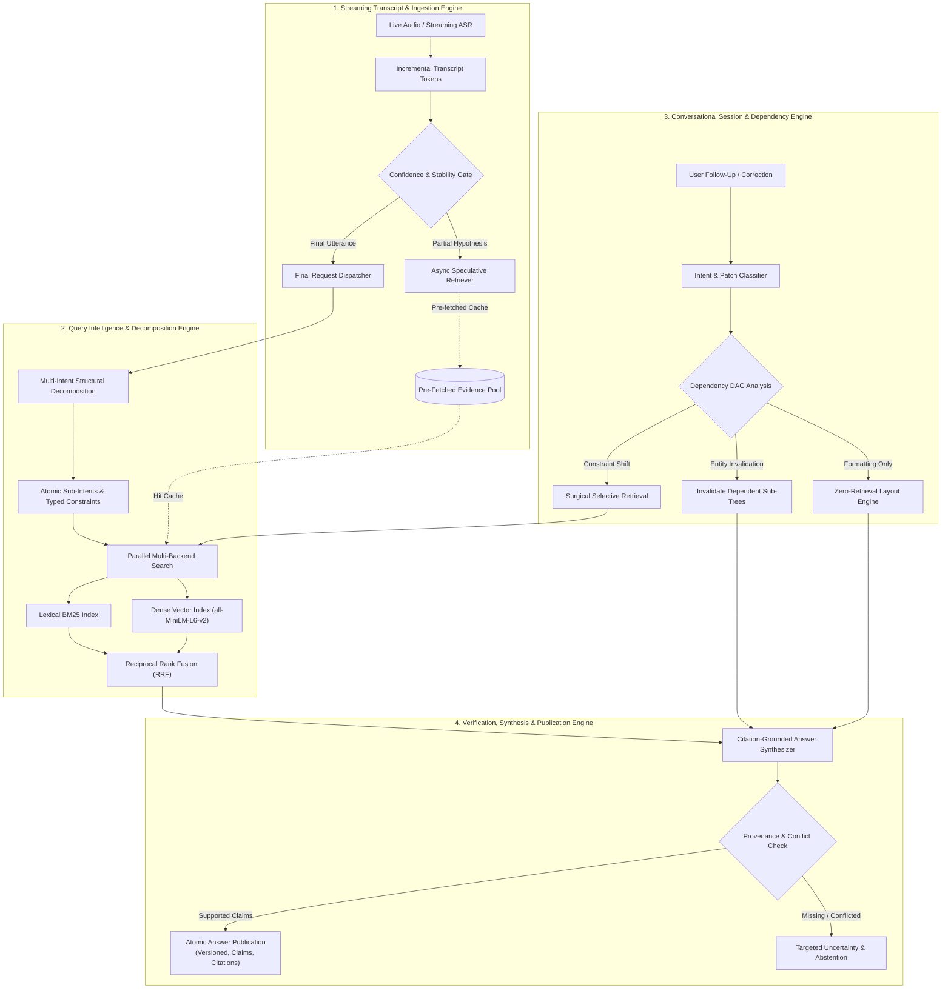

# FlowContext: Real-Time Streaming RAG Architecture

[](https://www.python.org/downloads/release/python-3110/)
[](tests/)
[](LICENSE)
[](src/flowcontext/embeddings.py)
[](#)
[](#)

**FlowContext** is an enterprise-grade, high-performance, real-time Streaming Live Retrieval-Augmented Generation (Live RAG) architecture engineered for the **Samsung PRISM Theme 4** specification. It resolves conversational latency and context drift in live transcript environments through **speculative early retrieval**, **multi-intent structural decomposition**, **hybrid dense-lexical fusion**, **dependency-aware selective conversational updates**, and **verifiable citation-grounded synthesis with explicit uncertainty quantification**.

---

## Table of Contents

- [Executive Overview](#executive-overview)
- [Unified System Architecture](#unified-system-architecture)
- [System Capabilities & Verification Matrix](#system-capabilities--verification-matrix)
- [Core Subsystems](#core-subsystems)
  - [1. Real-Time Streaming Ingestion & Speculative Scheduler](#1-real-time-streaming-ingestion--speculative-scheduler)
  - [2. Multi-Intent Decomposition & Hybrid RRF Retrieval](#2-multi-intent-decomposition--hybrid-rrf-retrieval)
  - [3. Dynamic Session State & Dependency Invalidation DAG](#3-dynamic-session-state--dependency-invalidation-dag)
  - [4. Grounded Synthesis & Provable Citation Verification](#4-grounded-synthesis--provable-citation-verification)
- [Quick Start & Setup](#quick-start--setup)
- [End-to-End Operational Workflows](#end-to-end-operational-workflows)
- [Multi-Turn Interaction Scenarios](#multi-turn-interaction-scenarios)
- [CLI Reference](#cli-reference)
- [Repository Layout](#repository-layout)
- [Engineering Standards & Integrity](#engineering-standards--integrity)
- [License](#license)

---

## Executive Overview

Conventional RAG pipelines operate synchronously: they wait until a speaker completes an utterance, execute computationally heavy full-index searches, and reconstruct the full conversational answer from scratch for even minor follow-ups or formatting tweaks. In live streaming audio and interactive transcript environments, this introduces unacceptable response latencies and excessive token consumption.

FlowContext fundamentally reimagines the conversational RAG lifecycle as a continuous, event-driven, dependency-tracked pipeline:

1. **Speculative Latency Hiding**: Predicts emerging intents from partial streaming tokens and triggers asynchronous background retrieval *before* utterance completion, slashing time-to-first-token.
2. **Hybrid Semantic & Lexical Precision**: Combines dense semantic vector representations (`sentence-transformers/all-MiniLM-L6-v2`) with exact BM25 keyword matching via Reciprocal Rank Fusion (RRF), ensuring zero parameter hand-tuning.
3. **Surgical Multi-Turn Updates**: Analyzes conversational follow-ups via a Dependency Directed Acyclic Graph (DAG). When an entity changes or a constraint is updated, only the invalidated sub-claims trigger re-retrieval; unaffected factual claims and formatting-only changes are preserved with zero redundant retrieval calls.
4. **Provable Grounding & Safe Uncertainty**: Every emitted claim is mathematically tied to explicit source chunk IDs and text spans. If an information need cannot be fully substantiated by retrieved evidence, FlowContext explicitly flags uncertainty rather than hallucinating.

---

## Unified System Architecture

The following diagram illustrates FlowContext's unified, end-to-end streaming data pipeline:


```mermaid
flowchart TD
    subgraph StreamLayer["1. Streaming Transcript & Ingestion Engine"]
        Audio["Live Audio / Streaming ASR"] --> TokenStream["Incremental Transcript Tokens"]
        TokenStream --> Gate{"Confidence & Stability Gate"}
        Gate -->|"Partial Hypothesis"| EarlyRet["Async Speculative Retriever"]
        Gate -->|"Final Utterance"| FinalReq["Final Request Dispatcher"]
        EarlyRet -.->|"Pre-fetched Cache"| EvidencePool[("Pre-Fetched Evidence Pool")]
    end

    subgraph QueryIntel["2. Query Intelligence & Decomposition Engine"]
        FinalReq --> IntentDecomp["Multi-Intent Structural Decomposition"]
        IntentDecomp --> SubIntents["Atomic Sub-Intents & Typed Constraints"]
        SubIntents --> HybridRet["Parallel Multi-Backend Search"]
        EvidencePool -.->|"Hit Cache"| HybridRet
        HybridRet --> BM25["Lexical BM25 Index"]
        HybridRet --> DenseVec["Dense Vector Index (all-MiniLM-L6-v2)"]
        BM25 & DenseVec --> RRF["Reciprocal Rank Fusion (RRF)"]
    end

    subgraph StateUpdate["3. Conversational Session & Dependency Engine"]
        FollowUp["User Follow-Up / Correction"] --> PatchClassifier["Intent & Patch Classifier"]
        PatchClassifier --> DepDAG{"Dependency DAG Analysis"}
        DepDAG -->|"Entity Invalidation"| InvalidateClaims["Invalidate Dependent Sub-Trees"]
        DepDAG -->|"Formatting Only"| ZeroRet["Zero-Retrieval Layout Engine"]
        DepDAG -->|"Constraint Shift"| SurgicalRet["Surgical Selective Retrieval"]
        SurgicalRet --> HybridRet
    end

    subgraph SynthesisLayer["4. Verification, Synthesis & Publication Engine"]
        RRF --> Synthesizer["Citation-Grounded Answer Synthesizer"]
        InvalidateClaims --> Synthesizer
        ZeroRet --> Synthesizer
        Synthesizer --> Verifier{"Provenance & Conflict Check"}
        Verifier -->|"Supported Claims"| Pub["Atomic Answer Publication\n(Versioned, Claims, Citations)"]
        Verifier -->|"Missing / Conflicted"| Uncertainty["Targeted Uncertainty & Abstention"]
    end
```

---

## System Capabilities & Verification Matrix

| Subsystem / Capability | Status | Architecture & Implementation Details | Verification Evidence |
|:---|:---:|:---|:---|
| **Deterministic Chunking & Ingestion** | `PASS` | SHA-256 fingerprinting, reproducible boundaries, structured JSONL schemas | [`src/flowcontext/ingestion.py`](src/flowcontext/ingestion.py) |
| **Lexical BM25 Retrieval Engine** | `PASS` | Inverted index preserving exact token spans, casing metadata, and offsets | [`src/flowcontext/retrieval.py`](src/flowcontext/retrieval.py) |
| **Dense Vector Semantic Embeddings** | `PASS` | Pinned `sentence-transformers/all-MiniLM-L6-v2` (384-dim, normalized L2, Apache-2.0) | [`src/flowcontext/embeddings.py`](src/flowcontext/embeddings.py) |
| **Speculative Streaming Scheduler** | `PASS` | Non-blocking async early retrieval with stale-event and race guards | [`src/flowcontext/scheduler.py`](src/flowcontext/scheduler.py) |
| **Multi-Intent Decomposition** | `PASS` | Structural decomposition into independent sub-queries with typed constraints | [`src/flowcontext/multi_intent.py`](src/flowcontext/multi_intent.py) |
| **Reciprocal Rank Fusion (RRF)** | `PASS` | Rank aggregation combining dense and lexical candidate lists without arbitrary score weighting | [`src/flowcontext/multi_intent.py`](src/flowcontext/multi_intent.py) |
| **Stateful Selective Updates** | `PASS` | Process-local session tracking with dependency DAGs and surgical delta updates | [`src/flowcontext/phase4.py`](src/flowcontext/phase4.py) |
| **Zero-Retrieval Formatting Suppression** | `PASS` | Presentation-only changes retain verified factual claims with 0 retrieval calls | [`examples/replay/phase4-formatting.jsonl`](examples/replay/phase4-formatting.jsonl) |
| **Provenance-Grounded Synthesis** | `PASS` | Factual claim construction with strict chunk citation mapping and contradiction detection | [`src/flowcontext/synthesis.py`](src/flowcontext/synthesis.py) |
| **Explicit Uncertainty Quantification** | `PASS` | Targeted abstention and partial-support detection for incomplete evidence | [`src/flowcontext/synthesis.py`](src/flowcontext/synthesis.py) |
| **Real LLM & Provider Integration** | `PASS` | Verified end-to-end execution with local Ollama (`qwen2.5:3b`) and OpenAI-compatible endpoints | [`reports/phase4_real_e2e_dense_test.json`](reports/phase4_real_e2e_dense_test.json) |
| **Automated Test Coverage** | `PASS` | **144 passed tests** across unit, integration, and end-to-end regression suites | [`tests/`](tests/) |

---

## Core Subsystems

### 1. Real-Time Streaming Ingestion & Speculative Scheduler

Live speech transcription emits incremental, partial hypotheses before settling on a finalized sentence. FlowContext's streaming controller monitors stability, token count, and intent cues in real time:

- **Early Speculative Trigger**: As soon as a stable intent boundary is detected (e.g., "Which venue in Pune..."), the scheduler dispatches background retrieval asynchronously.
- **Race Condition & Superseded Event Guards**: If the speaker pivots mid-sentence (e.g., "...no wait, in Mumbai"), the controller cancels or supersedes in-flight retrieval requests, preventing race conditions and stale cache poisoning.
- **Deduplication & Coalescing**: Duplicate or overlapping sub-query requests within short sliding windows are coalesced into unified batch fetches.

### 2. Multi-Intent Decomposition & Hybrid RRF Retrieval

Real-world user queries often combine multiple distinct information requirements into a single sentence (e.g., *"Find a conference room for 40 people in Pune and list lunch packages under $30"*):

- **Structural Decomposition**: Analyzes syntax and coordination to extract atomic sub-intents with explicit entity tags and constraints.
- **Hybrid Multi-Index Execution**: Each sub-intent is concurrently dispatched to:
  - **Dense Vector Search**: Semantic cosine similarity over normalized 384-dimensional embeddings (`all-MiniLM-L6-v2`).
  - **Lexical BM25 Search**: Exact keyword match over corpus tokens.
- **Reciprocal Rank Fusion (RRF)**: Merges the ranked candidate lists using standard $RRF(d) = \sum_{m \in M} \frac{1}{k + r_m(d)}$ ($k=60$), producing a balanced, robust ranking without requiring arbitrary score calibration.

### 3. Dynamic Session State & Dependency Invalidation DAG

In multi-turn conversations, re-retrieving the full corpus and regenerating entire responses for every follow-up turn wastes resources and disrupts conversational context:

- **In-Memory Session Store**: Tracks conversational turns, active entities, published answer versions, and claim dependencies.
- **Patch Classification**: Classifies follow-up utterances into typed delta operations:
  - `add_constraint`: Adds an additional filter (e.g., *"Must have a projector"*).
  - `replace_constraint` / `entity_change`: Replaces a core attribute (e.g., *"Actually, let's look at Venue B instead of Venue A"*).
  - `remove_constraint`: Relaxes an existing criterion.
  - `reformat_answer`: Presentation modification (e.g., *"Summarize that as bullet points"*).
- **Dependency DAG Invalidation**: When an entity or constraint changes, only the claims downstream of that entity in the dependency DAG are invalidated. Unaffected claims are preserved with their original citations. Presentation-only requests execute in zero retrieval calls.

### 4. Grounded Synthesis & Provable Citation Verification

FlowContext enforces strict factual grounding to eliminate conversational hallucination:

- **Atomic Answer Publication**: Emits immutable, versioned answer payloads ($v_1, v_2, \dots$) containing individual claims, supporting chunk IDs, and exact corpus text spans.
- **Strict Citation Tracking**: Every factual claim must be backed by one or more valid chunk IDs verified against the active corpus.
- **Targeted Uncertainty**: When an information need cannot be resolved by retrieved evidence, FlowContext explicitly flags that specific sub-intent as unresolved rather than attempting speculative generation.

---

## Quick Start & Setup

### 1. Installation

FlowContext is built for **Python 3.11** and managed with [`uv`](https://docs.astral.sh/uv/):

```bash
# Clone the repository
git clone https://github.com/Madhumasa84/Samsung_Prism.git
cd Samsung_Prism

# Install dependencies (CPU PyTorch + Sentence Transformers + Core RAG)
uv sync --locked --python 3.11 --extra dense
```

### 2. Environment & Pipeline Verification

Execute the complete automated test and smoke suite:

```bash
# 1. Environment configuration check
uv run flowcontext config-check

# 2. Offline core pipeline smoke check
uv run flowcontext smoke

# 3. Dense vector embedding offline verification
uv run flowcontext dense-smoke --local-files-only

# 4. Full pytest test suite (144 tests)
uv run pytest
```

---

## End-to-End Operational Workflows

### Building Ingestion Indices

Construct deterministic BM25 lexical indices and dense vector embeddings from source documents:

```bash
# Build BM25 lexical index
uv run flowcontext build-index \
  --input data/synthetic/documents.jsonl \
  --output artifacts/corpus-lexical-index.json \
  --backend lexical \
  --source-kind synthetic_fixture

# Query index directly
uv run flowcontext retrieve \
  --index artifacts/corpus-lexical-index.json \
  --source data/synthetic/documents.jsonl \
  --backend lexical \
  --query "Which venue in Pune accommodates 30 attendees?" \
  --top-k 3
```

### Running Streaming Speculative Replay

Simulate real-time streaming audio transcript feeds and compare baseline versus speculative execution:

```bash
# Baseline replay: waits for final utterance delivery
uv run flowcontext replay --mode baseline \
  --transcript examples/streaming/early-retrieval.jsonl \
  --index artifacts/corpus-lexical-index.json \
  --backend lexical \
  --execution-mode realtime --output artifacts/baseline.json

# Streaming speculative replay: triggers asynchronous early retrieval
uv run flowcontext replay --mode streaming \
  --transcript examples/streaming/early-retrieval.jsonl \
  --index artifacts/corpus-lexical-index.json \
  --backend lexical \
  --execution-mode realtime --output artifacts/streaming-replay.json
```

### Conversational Multi-Turn Session Replay

Replay multi-turn conversational interactions with surgical selective updating:

```bash
# Execute conversational replay with session state and selective invalidation
uv run flowcontext phase4-replay \
  --turns examples/replay/phase4-entity-correction.jsonl \
  --index artifacts/corpus-lexical-index.json \
  --output artifacts/session-trace.json
```

---

## Multi-Turn Interaction Scenarios

FlowContext includes end-to-end replay traces demonstrating distinct conversational situations:

| Interaction Scenario | Input Replay Script | System Behavior & Invalidation Strategy | Execution Trace |
|:---|:---|:---|:---|
| **Compound Multi-Need Query** | [`phase4-initial-compound.jsonl`](examples/replay/phase4-initial-compound.jsonl) | Decomposes compound venue and catering needs; publishes versioned answer $v_1$ | [`reports/phase4_replay_initial_compound.json`](reports/phase4_replay_initial_compound.json) |
| **Late Constraint Injection** | [`phase4-late-constraint.jsonl`](examples/replay/phase4-late-constraint.jsonl) | Surgically retrieves only for added constraint; preserves all existing factual claims | [`reports/phase4_replay_late_constraint.json`](reports/phase4_replay_late_constraint.json) |
| **Entity Correction** | [`phase4-entity-correction.jsonl`](examples/replay/phase4-entity-correction.jsonl) | Invalidates only dependent price/policy sub-branches of corrected entity | [`reports/phase4_replay_entity_correction.json`](reports/phase4_replay_entity_correction.json) |
| **Partial / Unsupported Turn** | [`phase4-partial-unsupported.jsonl`](examples/replay/phase4-partial-unsupported.jsonl) | Answers supported branch and explicitly flags unsupported needs with uncertainty | [`reports/phase4_replay_partial_unsupported.json`](reports/phase4_replay_partial_unsupported.json) |
| **Zero-Retrieval Formatting** | [`phase4-formatting.jsonl`](examples/replay/phase4-formatting.jsonl) | **0 retrieval calls**; updates presentation layout while retaining all citations | [`reports/phase4_replay_formatting.json`](reports/phase4_replay_formatting.json) |
| **Rapid Correction Race** | [`phase4-race.jsonl`](examples/replay/phase4-race.jsonl) | Cancels in-flight generation when user modifies speech before delivery | [`reports/phase4_replay_race.json`](reports/phase4_replay_race.json) |

---

## CLI Reference

FlowContext provides a unified command-line interface:

| Command | Subsystem | Description | Example Usage |
|:---|:---|:---|:---|
| `config-check` | Core | Validates environment variables and runtime settings | `flowcontext config-check` |
| `inspect-corpus` | Ingestion | Analyzes document structure, schemas, and token stats | `flowcontext inspect-corpus --input data.jsonl` |
| `build-index` | Indexing | Deterministically chunks and indices documents (dense/lexical) | `flowcontext build-index --input data.jsonl --output idx.json` |
| `retrieve` | Retrieval | Queries index using dense, BM25, or hybrid modes | `flowcontext retrieve --index idx.json --query "..."` |
| `replay` | Streaming | Executes streaming transcript replay (baseline vs streaming) | `flowcontext replay --transcript t.jsonl --mode streaming` |
| `phase4-replay` | Session | Replays multi-turn conversational follow-up sessions | `flowcontext phase4-replay --turns turns.jsonl` |
| `smoke` | Core | Executes full offline end-to-end integration check | `flowcontext smoke` |
| `dense-smoke` | Embeddings | Validates offline dense vector embedding generation | `flowcontext dense-smoke --local-files-only` |

---

## Repository Layout

```text
.
├── src/flowcontext/             # Core application package
│   ├── contracts.py             # Pydantic v2 schemas, event models & answer contracts
│   ├── config.py                # Environment and runtime settings management
│   ├── ingestion.py             # Deterministic chunking, SHA-256 hashing & index I/O
│   ├── indexing.py              # Index builder (dense, lexical, hybrid)
│   ├── embeddings.py            # SentenceTransformers wrapper and vector protocols
│   ├── retrieval.py             # Lexical BM25 & dense cosine similarity retrievers
│   ├── generation.py            # Structured grounded answer synthesis & repair loops
│   ├── scheduler.py             # Asynchronous speculative retrieval scheduler
│   ├── streaming.py             # Streaming transcript controller & stability rules
│   ├── multi_intent.py          # Structural query decomposition & RRF rank fusion
│   ├── synthesis.py             # Cross-intent evidence merging & uncertainty handling
│   ├── phase4.py                # Session store, patch classifier & dependency invalidation
│   ├── phase4_replay.py         # Multi-turn conversational replay engine
│   ├── phase4_evaluation.py     # Comprehensive matched evaluation harness
│   └── cli.py                   # Unified CLI entrypoints
├── data/
│   ├── synthetic/               # Synthetic corpus documents & transcripts (JSONL)
│   └── evaluation/              # Split-isolated evaluation cases & benchmarks
├── examples/
│   ├── streaming/               # Speculative streaming transcript scenarios
│   └── replay/                  # Multi-turn conversational replay scenarios
├── reports/                     # Machine-readable evaluation reports & execution traces
│   ├── phase4_evaluation.md     # Full-vs-selective evaluation report
│   ├── phase4_evaluation.json   # Machine-readable evaluation metrics
│   ├── phase4_evaluation_dense_test.md   # Dense retrieval evaluation report
│   ├── phase4_evaluation_dense_test.json # Dense retrieval evaluation metrics
│   ├── phase4_real_e2e.json     # Execution trace for real embedding probe & Ollama LLM
│   └── phase4_real_e2e_dense_test.json # Execution trace for integrated dense RAG
├── tests/                       # Complete unit, integration & regression test suite (144 tests)
├── docs/                        # Architecture deep-dives & subsystem specifications
│   ├── architecture-phase1.md   # Ingestion design & retrieval contracts
│   ├── architecture-phase3.md   # Multi-intent decomposition & RRF fusion
│   ├── architecture-phase4.md   # Dependency invalidation & selective updates
│   ├── phase5-handoff.md        # Production deployment roadmap & integration specifications
│   └── evaluation.md            # Evaluation methodologies & rubrics
├── pyproject.toml               # Package configuration, scripts & dependencies
└── LICENSE                      # MIT License
```

---

## Engineering Standards & Integrity

FlowContext is designed and built to rigorous software engineering and scientific standards:

1. **Deterministic Reproducibility**: Corpus chunking, SHA-256 fingerprinting, and retrieval scoring are completely deterministic. Given identical inputs, the pipeline produces identical indices and ranking scores.
2. **Strict Split Isolation**: Development and held-out evaluation scenarios are isolated in [`data/evaluation/`](data/evaluation/) with strict verification against cross-split data leakage.
3. **Robust Uncertainty Handling**: Hallucination prevention is prioritized over forced completion; unresolved intents trigger explicit abstention or targeted clarification requests.
4. **Security & Data Privacy**: Purely local process memory is utilized for session states. No API keys, credentials, or private user transcripts are stored or logged.

---

## License

This project is licensed under the [MIT License](LICENSE).
