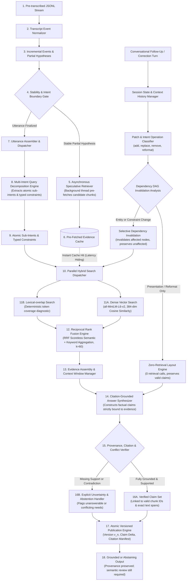

# FlowContext: Offline Streaming-Transcript RAG Prototype

[](https://www.python.org/downloads/release/python-3110/)
[](tests/)
[](LICENSE)
[](src/flowcontext/embeddings.py)
[](#)
[](#)
[](#real-llm--provider-integration-optional)

FlowContext is a Python prototype for **Samsung PRISM Theme 4: Live RAG**. Its Streamlit interface replays transcript events and shows retrieval, conversational updates, evidence, and versioned answers from the backend.

- Starts speculative retrieval from stable partial transcripts before the final event.
- Tracks claim and evidence dependencies when a user changes a constraint, corrects an entity, or requests new formatting.
- Validates citations and returns partial answers when evidence is insufficient.

The included demo uses synthetic fixtures. Microphone capture, speech recognition, and production persistence are outside the prototype's scope; semantic support still requires review.

## Submission materials

- **Source and setup:** [Quick Start](#quick-start--setup), [requirements.txt](requirements.txt), [locked dependencies](uv.lock), and [Dockerfile](Dockerfile).
- **Presentation:** [Final submission PPTX](docs/submission/VITVellore_TeamMakar_Submission.pptx) · [Google Slides authoring version](https://docs.google.com/presentation/d/1PSvYBQvsSGxgY4FFoeGJI2WgPqcR8IE2/edit?usp=sharing&ouid=100983024253913236100&rtpof=true&sd=true). Use the committed PPTX for submission; it contains corrected backend terminology and current results.
- **Demo video:** [Full-quality recording](assets/flowcontext-demo.mp4) (1:02 MP4); inline playback is below.
- **AI disclosure:** [Team-provided disclosure DOCX](docs/submission/AI_Usage_Disclosure.docx) and [current disclosure addendum](docs/submission/AI_Disclosure_Addendum.md) · [Google Doc](https://docs.google.com/document/d/12r-Jz7LeSJZfbUQVh9a0dyUP-vKS0yl9/edit?usp=sharing&ouid=100983024253913236100&rtpof=true&sd=true) · [Repository AI assistance log](AI_ASSISTANCE_LOG.md).
- **Verification:** [Final runtime check summary](docs/submission/verification.json). The default pipeline passes its automated tests; local Ollama generation has documented coverage limitations.
- **Mobile package:** Not applicable; this submission runs as a Python and Streamlit application.
- **Final submission tag:** [PRISM_GENAI_HACKATHON_Y2026](https://github.com/Madhumasa84/Samsung_Prism/tree/PRISM_GENAI_HACKATHON_Y2026). This tag fixes the exact version for judging, including code, setup files, presentation, disclosure, documentation, and the MP4 recording. Later changes to `main` do not change the tagged version.

### Recorded demo

https://github.com/user-attachments/assets/34861dc3-67d9-4df3-981d-60a7a8eb6465

---

## Table of Contents

- [Submission materials](#submission-materials)
- [Quick Start & Setup](#quick-start--setup)
  - [Use the demo](#6-use-the-demo)
  - [Ollama](#optional-use-an-installed-ollama-model)
  - [CPU dense retrieval](#optional-cpu-dense-retrieval)
  - [Docker](#docker-run-the-core-cli)
  - [Troubleshooting](#troubleshooting)
- [System Overview](#system-overview)
- [End-to-End System Architecture](#end-to-end-system-architecture)
- [System Capabilities & Verification Matrix](#system-capabilities--verification-matrix)
- [Core Architectural Pillars](#core-architectural-pillars)
  - [1. Streaming Ingestion & Speculative Latency Hiding](#1-streaming-ingestion--speculative-latency-hiding)
  - [2. Multi-Intent Decomposition & Hybrid RRF Search](#2-multi-intent-decomposition--hybrid-rrf-search)
  - [3. Dynamic Session State & Dependency Invalidation DAG](#3-dynamic-session-state--dependency-invalidation-dag)
  - [4. Grounded Synthesis & Provable Citation Verification](#4-grounded-synthesis--provable-citation-verification)
- [Real LLM / Provider Integration (Optional)](#real-llm--provider-integration-optional)
- [End-to-End Operational Workflows](#end-to-end-operational-workflows)
- [Conversational Replay Scenarios](#conversational-replay-scenarios)
- [CLI Reference](#cli-reference)
- [Repository Layout](#repository-layout)
- [Engineering Standards & Scientific Rigor](#engineering-standards--scientific-rigor)
- [License](#license)

---

## Quick Start & Setup

The default demo uses **lexical retrieval and Mock generation**. It runs on CPU and requires no CUDA, API key, Ollama service, or embedding-model download. Run all commands from the repository root.

### 1. Install the prerequisites

Install [Git](https://git-scm.com/downloads) and [uv](https://docs.astral.sh/uv/getting-started/installation/). The project uses Python 3.11; uv downloads it if a compatible interpreter is not installed.

Verify the tools in a terminal:

```bash
git --version
uv --version
```

Internet access is needed for the initial dependency installation. Once installed, the default demo runs locally with the included synthetic data. Ollama and Docker are optional.

### 2. Clone the repository

```bash
git clone https://github.com/Madhumasa84/Samsung_Prism.git
cd Samsung_Prism
```

The clone includes the application, example data, documentation, and full-quality demo recording. To reproduce the judged submission, select its tag before continuing:

```bash
git switch --detach PRISM_GENAI_HACKATHON_Y2026
```

This selects a fixed snapshot. To return to ongoing development later, run `git switch main`. Local indexes are created in the next steps.

### 3. Install the application and demo dependencies

```bash
uv sync --locked --python 3.11 --extra demo
```

This creates `.venv` and installs the locked dependencies, Streamlit, and development tools. You do not need to activate the virtual environment. The commands below use `uv run --no-sync` to run this installed environment without changing its optional packages.

### 4. Build the demo index

Run this command on Linux, macOS, WSL, or Windows PowerShell:

```bash
uv run --no-sync flowcontext build-index --input data/synthetic/phase4_documents.jsonl --output artifacts/corpus-index.json --backend lexical --source-kind synthetic_fixture
```

The command creates `artifacts/corpus-index.json`. The demo uses synthetic venue and catering documents; outputs describe these fixtures. You can skip this step on subsequent launches while the corpus remains unchanged.

### 5. Start the frontend

**Linux, macOS, or WSL:**

```bash
export FLOWCONTEXT_INDEX_PATH=artifacts/corpus-index.json
export FLOWCONTEXT_RETRIEVAL_BACKEND=lexical
export FLOWCONTEXT_MULTI_INTENT_RETRIEVAL_MODE=lexical
export FLOWCONTEXT_GENERATION_BACKEND=mock
export FLOWCONTEXT_GENERATION_PROVIDER=flowcontext.mock
uv run --no-sync streamlit run app.py
```

**Windows PowerShell:**

```powershell
$env:FLOWCONTEXT_INDEX_PATH = "artifacts/corpus-index.json"
$env:FLOWCONTEXT_RETRIEVAL_BACKEND = "lexical"
$env:FLOWCONTEXT_MULTI_INTENT_RETRIEVAL_MODE = "lexical"
$env:FLOWCONTEXT_GENERATION_BACKEND = "mock"
$env:FLOWCONTEXT_GENERATION_PROVIDER = "flowcontext.mock"
uv run --no-sync streamlit run app.py
```

Open **http://localhost:8501** in your browser. Keep the terminal running; press **Ctrl+C** there to stop the server. Run the same launch commands to start it again.

A `.env` file is optional for this setup. If you create one from `.env.example`, note that its retrieval default is dense; the launch settings above explicitly select lexical retrieval. Export provider API keys in your shell, rather than storing them in `.env`.

### 6. Use the demo

1. In the sidebar, choose **A · Streaming retrieval** and **Generation → Mock**.
2. Under **Corpus & retrieval**, select `artifacts/corpus-index.json` and **lexical**. For scenario A, also select **lexical** as the multi-intent retrieval mode.
3. Keep **Transcript → Editable utterance**. Edit the request text on the main page, or use the supplied request.
4. Keep the end-of-speech pause at **0.8 seconds** and select **realtime** execution to observe retrieval during the simulated transcript. **accelerated** skips source-time waits.
5. Click **Play**. The backend computes the result, and the interface reveals its trace and answer in stages.
6. Use **Pause** to stop the reveal, change **Playback → Speed** to control the reveal rate, or click **Reset** to clear the result. Changing a scenario or request setting also clears the previous run.

The input is a text/transcript replay; microphone capture and speech recognition are not included. Playback speed controls how an already computed trace is shown, rather than model inference speed.

| Sidebar scenario | What to inspect |
|:---|:---|
| **A · Streaming retrieval** | Retrieval timing, decomposed intents, evidence, and the final answer. |
| **B · Constraint update** | A follow-up changes the attendee count; inspect which claims and evidence change. |
| **C · Entity correction** | Switching venues invalidates dependent claims and admits replacement evidence. |
| **D · Answer formatting** | The formatting version preserves claims with zero retrieval calls and zero generation attempts. |
| **E · Unsupported constraint** | A 50-attendee request has insufficient supporting evidence and produces a partial answer. |
| **F · Concurrent correction** | A newer request supersedes an older one; inspect the rejected stale publication. |

Scenario A accepts an editable utterance. B–F use their scenario turn inputs. Outputs are recomputed by the backend, including partial or failed outcomes. The local `evaluation_evidence/` archive is not required.

### Optional: use an installed Ollama model

Complete the setup above first. Install [Ollama](https://docs.ollama.com/quickstart) and open its desktop application, or run the server in a separate terminal if it is not already running:

```bash
ollama serve
```

In another terminal, list the installed models:

```bash
ollama list
```

Use the exact name from that list in the Streamlit sidebar. To install the model used in the recorded local checks, run this once if it is not already available:

```bash
ollama pull qwen2.5:3b
```

In the sidebar, select **Generation → Local Ollama**, enter the installed model name, leave **Local Ollama server** at `http://127.0.0.1:11434/v1`, and set **Model request timeout** to **120 seconds**. Click **Play** to recompute the scenario using the model. Keep both Streamlit and Ollama running.

Local Ollama requires no API key and can run on CPU. CPU responses may be slow. Qwen2.5:3b connected successfully in the local checks, but A, B, and D did not consistently answer all supported intents. Use Mock for repeatable fixture demonstrations and inspect Ollama's actual partial answers when showing local inference. See [provider integration](#real-llm--provider-integration-optional) for CLI configuration and the recorded results.

### Optional: CPU dense retrieval

Dense retrieval uses the pinned MiniLM embedding model. This setup downloads CPU PyTorch and the embedding weights without requiring CUDA:

```bash
uv sync --locked --python 3.11 --extra demo
uv pip install --python .venv 'torch==2.14.0+cpu' --index https://download.pytorch.org/whl/cpu
uv pip install --python .venv -e '.[dense,demo]'
uv run --no-sync flowcontext build-index --input data/synthetic/phase4_documents.jsonl --output artifacts/corpus-dense-index.json --backend dense --source-kind synthetic_fixture
uv run --no-sync streamlit run app.py
```

These commands work in Bash and PowerShell. In the sidebar, select `artifacts/corpus-dense-index.json`, **dense** retrieval, and **dense** or **hybrid** for scenario A's multi-intent retrieval mode. The initial index build downloads the pinned MiniLM weights if they are not cached. Continue using `--no-sync` to preserve the CPU PyTorch installation; a regular locked sync with the dense extra can select NVIDIA packages.

### Verify the installation

From the repository root, run:

```bash
uv run --no-sync flowcontext config-check
uv run --no-sync flowcontext smoke
uv run --no-sync python -m pytest -q
```

The latest verified full suite passed **169 tests**. The smoke command exercises the local fixture pipeline; its results are not an official benchmark. If you installed the dense extra and cached its model, also run:

```bash
uv run --no-sync flowcontext dense-smoke --local-files-only
```

#### Known Flaky Tests

Some streaming-scheduler tests depend on background-worker timing and can intermittently fail on heavily loaded hosts. Rerun affected tests in isolation and inspect their traces when diagnosing a failure. The most recent full verification passed all 169 tests.

### Docker: run the core CLI

The supplied Dockerfile packages the core CLI and fixture data. The Streamlit frontend, dense extra, and Ollama server are installed separately using the instructions above.

With Docker running, build and verify the image:

```bash
docker build -t flowcontext .
docker run --rm flowcontext smoke
```

Pass a CLI command after the image name, for example `docker run --rm flowcontext config-check`. Files written inside a container are temporary unless you mount a host directory.

### Alternative: install with pip

If you prefer pip, install Python 3.11 and use a virtual environment. This installs the dependency ranges from `requirements.txt`; use uv for the locked setup above.

**Linux, macOS, or WSL:**

```bash
python3.11 -m venv .venv
.venv/bin/python -m pip install -r requirements.txt pytest
```

**Windows PowerShell:**

```powershell
py -3.11 -m venv .venv
.venv\Scripts\python.exe -m pip install -r requirements.txt pytest
```

Use `.venv/bin/flowcontext` in place of `uv run --no-sync flowcontext`, and `.venv/bin/python -m streamlit run app.py` to launch the frontend. On Windows, use `.venv\Scripts\flowcontext.exe` and `.venv\Scripts\python.exe -m streamlit run app.py`. Apply the same shell environment settings from step 5.

### Troubleshooting

| Symptom | Action |
|:---|:---|
| `uv` or `git` is not found | Install the missing prerequisite and reopen the terminal. |
| The demo says the index cannot be loaded | Run step 4 from the repository root, then reload the page. |
| A dense/index backend mismatch appears | Match the sidebar backend to the selected index: lexical index with lexical, dense index with dense. |
| Ollama cannot be reached | Start Ollama and run `ollama list` in the same environment as Streamlit. The configured loopback endpoint must be reachable there. |
| Ollama reports an unknown model | Enter the exact installed name from `ollama list`, or download it with `ollama pull`. |
| The model times out or returns a partial answer | Inspect the displayed error or unsupported intents. CPU inference can exceed the request timeout; Mock provides a repeatable fixture run. |
| Port 8501 is already in use | Launch with `uv run --no-sync streamlit run app.py --server.port 8502` and open `http://localhost:8502`. |
| The corpus changed after indexing | Rebuild the matching index with the build command and `--force`. |

---

## System Overview

Standard Retrieval-Augmented Generation (RAG) pipelines operate on a rigid sequential cycle: speech completes, full query parsing begins, corpus retrieval executes, and answer generation runs from zero. In conversational voice and live transcript applications, this sequential bottleneck introduces high latency, excessive token consumption, and context fragmentation.

**FlowContext** is an engineering prototype for the **Samsung PRISM Theme 4 (Live RAG)** concept. The repository implements transcript replay, retrieval, generation, session state, and a Streamlit demonstration interface. Audio capture, speech recognition, and production persistence are outside the current scope:

- **Speculative Latency Hiding**: Consumes incremental transcript events and issues bounded early retrieval queries on stable partial hypotheses.
- **Dense and lexical retrieval**: Supports pinned local dense embeddings plus a deterministic lexical-overlap diagnostic backend; the lexical backend is not BM25.
- **Fine-Grained Conversational Memory**: Tracks active entities and claims within a directed dependency graph (DAG), enabling selective re-retrieval when details change and instant zero-retrieval reformatting.
- **Verifiable Citation Grounding**: Publishes atomic, versioned answer records where each factual claim references exact document chunk spans, paired with explicit uncertainty handling whenever information is unanswerable.

---

## End-to-End System Architecture

FlowContext connects streaming transcript processing, speculative scheduling, hybrid retrieval, dependency invalidation, and grounded synthesis into a single unified top-to-bottom pipeline:


```mermaid
flowchart TD
    %% 1. Ingestion & Transcript Stream Layer
    In1["1. Pre-transcribed JSONL Stream"] --> In2["2. Transcript Event Normalizer"]
    In2 --> In3["3. Incremental Events & Partial Hypotheses"]
    
    %% 2. Stability & Speculative Fast Path
    In3 --> Gate1{"4. Stability & Intent Boundary Gate"}
    Gate1 -->|"Stable Partial Hypothesis"| Spec1["5. Asynchronous Speculative Retriever\n(Background thread pre-fetches candidate chunks)"]
    Spec1 --> Cache1[("6. Pre-Fetched Evidence Cache")]
    
    %% 3. Utterance Finalization & Decomposition
    Gate1 -->|"Utterance Finalized"| Decomp1["7. Utterance Assembler & Dispatcher"]
    Decomp1 --> Decomp2["8. Multi-Intent Query Decomposition Engine\n(Extracts atomic sub-intents & typed constraints)"]
    Decomp2 --> SubIntents["9. Atomic Sub-Intents & Typed Constraints"]
    
    %% 4. Conversational State & Dependency DAG
    FollowUp["Conversational Follow-Up / Correction Turn"] --> Sess1["Session State & Context History Manager"]
    Sess1 --> Patch1["Patch & Intent Operation Classifier\n(add, replace, remove, reformat)"]
    Patch1 --> DAG1{"Dependency DAG Invalidation Analysis"}
    DAG1 -->|"Presentation / Reformat Only"| ZeroRet["Zero-Retrieval Layout Engine\n(0 retrieval calls, preserves valid claims)"]
    DAG1 -->|"Entity or Constraint Change"| Inval1["Selective Dependency Invalidation\n(Invalidates affected nodes, preserves unaffected)"]
    
    %% 5. Parallel Hybrid Retrieval
    SubIntents --> RetDispatch["10. Parallel Hybrid Search Dispatcher"]
    Inval1 --> RetDispatch
    Cache1 -.->|"Instant Cache Hit (Latency Hiding)"| RetDispatch
    
    RetDispatch --> DenseSearch["11A. Dense Vector Search\n(all-MiniLM-L6-v2, 384-dim Cosine Similarity)"]
    RetDispatch --> LexSearch["11B. Lexical-overlap Search\n(Deterministic token coverage diagnostic)"]
    
    %% 6. Reciprocal Rank Fusion
    DenseSearch --> RRF["12. Reciprocal Rank Fusion Engine\n(RRF Scoreless Semantic + Keyword Aggregation, k=60)"]
    LexSearch --> RRF
    
    %% 7. Evidence Assembly & Grounded Synthesis
    RRF --> ContextAssy["13. Evidence Assembly & Context Window Manager"]
    ContextAssy --> Synth1["14. Citation-Grounded Answer Synthesizer\n(Constructs factual claims strictly bound to evidence)"]
    ZeroRet --> Synth1
    
    %% 8. Provenance & Contradiction Verification
    Synth1 --> VerifGate{"15. Provenance, Citation & Conflict Verifier"}
    VerifGate -->|"Fully Grounded & Supported"| ValidClaims["16A. Verified Claim Set\n(Linked to valid chunk IDs & exact text spans)"]
    VerifGate -->|"Missing Support or Contradiction"| UncertHandler["16B. Explicit Uncertainty & Abstention Handler\n(Flags unanswerable or conflicting needs)"]
    
    %% 9. Atomic Versioned Delivery
    ValidClaims --> Pub["17. Atomic Versioned Publication Engine\n(Version v_n, Claim Delta, Citation Manifest)"]
    UncertHandler --> Pub
    Pub --> FinalOut["18. Grounded or Abstaining Output\n(Provenance preserved; semantic review still required)"]
```

---

## System Capabilities & Verification Matrix

| Subsystem / Capability | Status | Architecture & Implementation Details | Verification Evidence |
|:---|:---:|:---|:---|
| **Deterministic Ingestion & Chunking** | `PASS` | SHA-256 fingerprinting, reproducible boundaries, structured JSONL schemas | [`src/flowcontext/ingestion.py`](src/flowcontext/ingestion.py) |
| **Lexical-overlap Retrieval** | `MEASURED**` | Deterministic unique-token coverage diagnostic; not BM25 | [`src/flowcontext/retrieval.py`](src/flowcontext/retrieval.py) |
| **Dense Vector Retrieval Smoke** | `MEASURED**` | Pinned `sentence-transformers/all-MiniLM-L6-v2` (384-dim); integrated live generation remains unverified | [`src/flowcontext/embeddings.py`](src/flowcontext/embeddings.py) |
| **Speculative Transcript Scheduler** | `PASS*` | Bounded replay scheduler with stale-event and race guards; audio/ASR are external | [`src/flowcontext/scheduler.py`](src/flowcontext/scheduler.py) |
| **Multi-Intent Decomposition** | `PASS` | Structural decomposition into independent sub-queries with typed constraints | [`src/flowcontext/multi_intent.py`](src/flowcontext/multi_intent.py) |
| **Reciprocal Rank Fusion (RRF)** | `PASS` | Rank aggregation combining dense and lexical candidate lists without arbitrary score weighting | [`src/flowcontext/multi_intent.py`](src/flowcontext/multi_intent.py) |
| **Stateful Selective Updates** | `PASS` | Process-local session tracking with dependency DAGs and surgical delta updates | [`src/flowcontext/phase4.py`](src/flowcontext/phase4.py) |
| **Zero-Retrieval Formatting Suppression** | `PASS` | Presentation-only changes retain verified factual claims with 0 retrieval calls | [`examples/replay/phase4-formatting.jsonl`](examples/replay/phase4-formatting.jsonl) |
| **Provenance-Grounded Synthesis** | `PASS` | Factual claim construction with strict chunk citation mapping and contradiction detection | [`src/flowcontext/synthesis.py`](src/flowcontext/synthesis.py) |
| **Explicit Uncertainty Quantification** | `PASS` | Targeted abstention and partial-support detection for incomplete evidence | [`src/flowcontext/synthesis.py`](src/flowcontext/synthesis.py) |
| **Real LLM & Provider Integration** | `PARTIAL` | Local Ollama inference exercised JSON, citation, formatting and stale-publication checks; Qwen2.5:3b left some fixture intents unanswered. Hosted providers remain unverified. Default generation is mock. | [`Local Qwen smoke results`](reports/ollama_qwen25_3b_smoke.json), [`generation.py`](src/flowcontext/generation.py) |
| **Automated Test Coverage** | `PASS***` | **169 tests passed** in the latest full verification; some streaming-scheduler tests are timing-sensitive under host load | [`tests/`](tests/) |

`*` Engineering-contract result on local replay fixtures. `**` Local measurement, not an official benchmark or semantic-quality claim. `***` See [Known Flaky Tests](#known-flaky-tests) for reproduction notes.

---

## Core Architectural Pillars

### 1. Streaming Ingestion & Speculative Latency Hiding

In interactive voice and transcript applications, human speech is emitted in partial bursts. FlowContext's streaming controller operates concurrently with the incoming transcript stream:

- **Early Speculative Trigger**: As soon as a stable intent boundary is detected (e.g., *"Which venue in Pune can host..."*), the scheduler initiates background retrieval asynchronously before the user completes the utterance.
- **Race Condition & Superseded Event Guards**: If the speaker changes direction mid-sentence (e.g., *"...no wait, in Mumbai"*), the controller cancels or supersedes in-flight retrieval requests, preventing race conditions and stale cache poisoning.
- **Deduplication & Coalescing**: Duplicate or overlapping sub-query requests within short sliding windows are coalesced into unified batch fetches.

### 2. Multi-Intent Decomposition & Hybrid RRF Search

Complex conversational requests frequently contain multiple overlapping constraints and comparisons (e.g., *"Find a conference hall for 40 people in Pune and list lunch packages under $30"*):

- **Structural Decomposition**: Syntactically decomposes complex sentences into atomic sub-intents with typed constraints (location, capacity, catering, amenities).
- **Parallel Multi-Backend Search**: Dispatches each sub-intent concurrently across dense semantic vector space (`sentence-transformers/all-MiniLM-L6-v2`) and the deterministic lexical-overlap diagnostic backend.
- **Reciprocal Rank Fusion (RRF)**: Fuses candidate lists using $RRF(d) = \sum_{m \in M} \frac{1}{k + r_m(d)}$ ($k=60$), delivering balanced retrieval robustness without requiring fragile manual score tuning.

### 3. Dynamic Session State & Dependency Invalidation DAG

In multi-turn conversations, re-retrieving the full corpus and regenerating entire answers from scratch for every follow-up turn wastes resources and disrupts conversational context:

- **In-Memory Session Graph**: Tracks conversational turns, active entities, published answer versions, and claim dependencies.
- **Patch Classification**: Classifies follow-up utterances into typed delta operations:
  - `add_constraint`: Adds an additional filter (e.g., *"Must include a projector"*).
  - `replace_constraint` / `entity_change`: Replaces a core attribute (e.g., *"Let's look at Venue B instead of Venue A"*).
  - `remove_constraint`: Relaxes an existing criterion.
  - `reformat_answer`: Presentation modification (e.g., *"Summarize that as bullet points"*).
- **Dependency DAG Invalidation**: When an entity or constraint changes, only the claims downstream of that entity in the dependency DAG are invalidated. Unaffected claims are preserved with their original citations. Presentation-only requests execute with **zero retrieval calls**.

### 4. Grounded Synthesis & Provable Citation Verification

FlowContext enforces strict factual grounding to eliminate conversational hallucination:

- **Atomic Answer Publication**: Emits immutable, versioned answer payloads ($v_1, v_2, \dots$) containing individual claims, supporting chunk IDs, and exact corpus text spans.
- **Strict Citation Tracking**: Every factual claim is validated against chunk IDs present in the active corpus.
- **Targeted Uncertainty**: When an information need cannot be resolved by retrieved evidence, FlowContext explicitly flags that specific sub-intent as unresolved rather than attempting speculative generation.

---

## Real LLM / Provider Integration (Optional)

### Local Ollama generation

Ollama can generate answers through the same replay workflows. Start your local
Ollama service, run `ollama list`, and choose an installed model. In the Streamlit
sidebar select **Generation → Local Ollama**, then enter the model name. The
default is `qwen2.5:3b`. The local server defaults to `http://127.0.0.1:11434/v1`.
This works on CPU and needs neither CUDA nor an API key. Changing the model or
generation source clears the previous run. The **Model generation** badge identifies
local model generation; **Mock** remains available for deterministic demonstrations.

For CLI replay, use these environment settings (POSIX shell syntax):

```bash
export FLOWCONTEXT_GENERATION_BACKEND=openai_compatible
export FLOWCONTEXT_GENERATION_PROVIDER=ollama
export FLOWCONTEXT_GENERATION_MODEL=qwen2.5:3b
export FLOWCONTEXT_GENERATION_BASE_URL=http://127.0.0.1:11434/v1
export FLOWCONTEXT_GENERATION_TIMEOUT_S=120
export FLOWCONTEXT_GENERATION_MAX_RETRIES=0
export FLOWCONTEXT_GENERATION_MAX_OUTPUT_TOKENS=1200
```

The `ollama` provider uses the local chat-completions API with a JSON answer schema.
It never forwards a hosted-provider API key. Loopback URLs are required for this
local mode; authenticated remote servers can use the generic configured provider.
All existing citation, excerpt, intent-alignment, and stale-publication checks
remain active. An invalid or unsupported model answer is rejected, not replaced
with a mock answer. The model must already be installed; neither the demo nor the
smoke tool downloads models.

Run the real-model checks for scenarios A–F with:

```bash
uv run --no-sync python tools/ollama_smoke.py --model qwen2.5:3b
```

Run this after installing the demo dependencies above. Detailed outputs go to the ignored local artifact
`artifacts/ollama-smoke.json`; the tool exits unsuccessfully if a scenario check
fails. Its wall-clock measurements describe the replay call on your machine,
not official benchmark scores or backend Phase 4 update latency.

The recorded [Qwen2.5:3b CPU smoke run](reports/ollama_qwen25_3b_smoke.json)
exercised all six scenarios. C, E and F passed their fixture checks; A, B and D
left the catering intent unanswered. F also returned a partial answer, although
its supersession and stale-publication checks passed. The Ollama path therefore
works, but this small model is not a reliable substitute for the mock demo's
complete fixture coverage. Schema-guided JSON does not guarantee a grounded,
complete answer. Use Mock for a repeatable presentation and Ollama to inspect
actual local-model behavior. These observations are from one warm-model run.

### Hosted or other compatible providers

**By default, FlowContext ships fully offline with a deterministic mock generation backend**
(`generation_provider: flowcontext.mock`). `flowcontext config-check` reports
`generation_api_key_configured: false` and `flowcontext smoke` reports `"backend": "mock"`
until this section is followed. No vendor-specific provider (Sarvam or otherwise) is
hard-coded anywhere in this repository. The generic generation adapter is an
**OpenAI-compatible** `/v1/chat/completions` client (see
[`src/flowcontext/generation.py`](src/flowcontext/generation.py)). Any provider that exposes
an OpenAI-compatible chat-completions endpoint (Sarvam included) can be wired in through that
same adapter — there is no separate Sarvam SDK or Sarvam-specific code path.

To point the generic adapter at a real provider, set the following environment variables
before invoking the CLI. **The API key variable name is configurable** — the app reads the key
from whichever environment variable `FLOWCONTEXT_GENERATION_API_KEY_ENV` names; it does not
hard-code `FLOWCONTEXT_GENERATION_API_KEY`, but that is the conventional default used below:

```bash
export FLOWCONTEXT_GENERATION_BACKEND=openai_compatible
export FLOWCONTEXT_GENERATION_PROVIDER=<provider-name>          # e.g. sarvam
export FLOWCONTEXT_GENERATION_MODEL=<model-name>                # e.g. sarvam-m
export FLOWCONTEXT_GENERATION_BASE_URL=https://<provider-endpoint>/v1
export FLOWCONTEXT_GENERATION_API_KEY_ENV=FLOWCONTEXT_GENERATION_API_KEY
export FLOWCONTEXT_GENERATION_API_KEY=<secret-in-process-environment-only>

uv run --no-sync flowcontext evaluate-suite \
  --cases data/evaluation/development.jsonl \
  --split development \
  --corpus artifacts/fixture-lexical-index.json \
  --backend lexical \
  --execution-mode accelerated
```

The secret is read only from that process environment variable; it is never logged, persisted,
or included in trace/error output — only the *name* of the configured env var appears in
diagnostics. See [`docs/evaluation.md`](docs/evaluation.md#real-provider-verification) for the
full real-provider verification walkthrough and interpretation of `audit_status` /
`verification_status` / `release_status`. The committed Ollama smoke report uses a
real local model with synthetic fixtures and records incomplete intent coverage.
Hosted-provider runs and official benchmark performance remain unverified; the
[Verification Matrix](#system-capabilities--verification-matrix) marks real-provider
integration `PARTIAL` for that reason.

---

## End-to-End Operational Workflows

### Building Ingestion Indices

Construct deterministic lexical-overlap indices and optional dense vector embeddings from source documents:

```bash
# Build lexical-overlap diagnostic index
uv run --no-sync flowcontext build-index \
  --input data/synthetic/documents.jsonl \
  --output artifacts/corpus-lexical-index.json \
  --backend lexical \
  --source-kind synthetic_fixture

# Query index directly
uv run --no-sync flowcontext retrieve \
  --index artifacts/corpus-lexical-index.json \
  --source data/synthetic/documents.jsonl \
  --backend lexical \
  --query "Which venue in Pune accommodates 30 attendees?" \
  --top-k 3
```

### Running Streaming Speculative Replay

Replay incremental transcript events and compare baseline versus speculative execution:

```bash
# Baseline replay: waits for final utterance delivery
uv run --no-sync flowcontext replay --mode baseline \
  --transcript examples/streaming/early-retrieval.jsonl \
  --index artifacts/corpus-lexical-index.json \
  --backend lexical \
  --execution-mode realtime --output artifacts/baseline.json

# Streaming speculative replay: triggers asynchronous early retrieval
uv run --no-sync flowcontext replay --mode streaming \
  --transcript examples/streaming/early-retrieval.jsonl \
  --index artifacts/corpus-lexical-index.json \
  --backend lexical \
  --execution-mode realtime --output artifacts/streaming-replay.json
```

### Conversational Multi-Turn Session Replay

Replay multi-turn conversational interactions with surgical selective updating:

```bash
# Execute conversational replay with session state and selective invalidation
uv run --no-sync flowcontext phase4-replay \
  --turns examples/replay/phase4-entity-correction.jsonl \
  --index artifacts/corpus-lexical-index.json \
  --output artifacts/session-trace.json

# Optional single-writer durable session snapshot
uv run --no-sync flowcontext phase4-replay \
  --turns examples/replay/phase4-entity-correction.jsonl \
  --index artifacts/corpus-lexical-index.json \
  --session-store artifacts/phase4-sessions.json

# Resume that session in a later process with follow-up-only turns
uv run --no-sync flowcontext phase4-replay \
  --turns examples/replay/phase4-resume-follow-up.jsonl \
  --index artifacts/corpus-lexical-index.json \
  --session-store artifacts/phase4-sessions.json --resume
```

Evaluation commands expose separate `audit_status`, `workflow_status`,
`verification_status`, and `release_status` fields. A local fixture can pass
its engineering invariants while still returning `PARTIAL` and exit code `2`
when official assets, semantic review, or a live provider are missing.

---

## Conversational Replay Scenarios

FlowContext includes end-to-end replay traces demonstrating distinct conversational situations:

| Interaction Scenario | Input Replay Script | System Behavior & Invalidation Strategy | Execution Trace |
|:---|:---|:---|:---|
| **Compound Multi-Need Query** | [`phase4-initial-compound.jsonl`](examples/replay/phase4-initial-compound.jsonl) | Decomposes compound venue and catering needs; publishes versioned answer $v_1$ | [`reports/phase4_replay_initial_compound.json`](reports/phase4_replay_initial_compound.json) |
| **Late Constraint Injection** | [`phase4-late-constraint.jsonl`](examples/replay/phase4-late-constraint.jsonl) | Surgically retrieves only for added constraint; preserves all existing factual claims | [`reports/phase4_replay_late_constraint.json`](reports/phase4_replay_late_constraint.json) |
| **Entity Correction** | [`phase4-entity-correction.jsonl`](examples/replay/phase4-entity-correction.jsonl) | Invalidates only dependent price/policy sub-branches of corrected entity | [`reports/phase4_replay_entity_correction.json`](reports/phase4_replay_entity_correction.json) |
| **Partial / Unsupported Turn** | [`phase4-partial-unsupported.jsonl`](examples/replay/phase4-partial-unsupported.jsonl) | Answers supported branch and explicitly flags unsupported needs with uncertainty | [`reports/phase4_replay_partial_unsupported.json`](reports/phase4_replay_partial_unsupported.json) |
| **Zero-Retrieval Formatting** | [`phase4-formatting.jsonl`](examples/replay/phase4-formatting.jsonl) | **0 retrieval calls**; updates presentation layout while retaining all citations | [`reports/phase4_replay_formatting.json`](reports/phase4_replay_formatting.json) |
| **Rapid Correction Race** | [`phase4-race.jsonl`](examples/replay/phase4-race.jsonl) | Cancels in-flight generation when user modifies speech before delivery | [`reports/phase4_replay_race.json`](reports/phase4_replay_race.json) |

---

## CLI Reference

FlowContext provides a unified command-line interface:

| Command | Subsystem | Description | Example Usage |
|:---|:---|:---|:---|
| `config-check` | Core | Validates environment variables and runtime settings | `flowcontext config-check` |
| `inspect-corpus` | Ingestion | Analyzes document structure, schemas, and token stats | `flowcontext inspect-corpus --input data.jsonl` |
| `build-index` | Indexing | Deterministically chunks and indices documents (dense/lexical) | `flowcontext build-index --input data.jsonl --output idx.json` |
| `retrieve` | Retrieval | Queries index using dense, lexical-overlap, or hybrid modes | `flowcontext retrieve --index idx.json --query "..."` |
| `replay` | Streaming | Executes streaming transcript replay (baseline vs streaming) | `flowcontext replay --transcript t.jsonl --mode streaming` |
| `phase4-replay` | Session | Replays multi-turn conversational follow-up sessions | `flowcontext phase4-replay --turns turns.jsonl` |
| `smoke` | Core | Executes full offline end-to-end integration check | `flowcontext smoke` |
| `dense-smoke` | Embeddings | Validates offline dense vector embedding generation | `flowcontext dense-smoke --local-files-only` |

---

## Repository Layout

```text
.
├── src/flowcontext/             # Core application package
│   ├── contracts.py             # Pydantic v2 schemas, event models & answer contracts
│   ├── config.py                # Environment and runtime settings management
│   ├── ingestion.py             # Deterministic chunking, SHA-256 hashing & index I/O
│   ├── indexing.py              # Index builder (dense, lexical, hybrid)
│   ├── embeddings.py            # SentenceTransformers wrapper and vector protocols
│   ├── retrieval.py             # Lexical-overlap & dense cosine similarity retrievers
│   ├── generation.py            # Structured grounded answer synthesis & repair loops
│   ├── scheduler.py             # Asynchronous speculative retrieval scheduler
│   ├── streaming.py             # Streaming transcript controller & stability rules
│   ├── multi_intent.py          # Structural query decomposition & RRF rank fusion
│   ├── synthesis.py             # Cross-intent evidence merging & uncertainty handling
│   ├── phase4.py                # Session store, patch classifier & dependency invalidation
│   ├── phase4_replay.py         # Multi-turn conversational replay engine
│   ├── phase4_evaluation.py     # Comprehensive matched evaluation harness
│   └── cli.py                   # Unified CLI entrypoints
├── data/
│   ├── synthetic/               # Synthetic corpus documents & transcripts (JSONL)
│   └── evaluation/              # Split-isolated evaluation cases & benchmarks
├── examples/
│   ├── streaming/               # Speculative streaming transcript scenarios
│   └── replay/                  # Multi-turn conversational replay scenarios
├── reports/                     # Machine-readable evaluation reports & execution traces
│   ├── phase4_evaluation.md     # Full-vs-selective evaluation report
│   ├── phase4_evaluation.json   # Machine-readable evaluation metrics
│   ├── phase4_evaluation_dense_test.md   # Dense retrieval evaluation report
│   ├── phase4_evaluation_dense_test.json # Dense retrieval evaluation metrics
│   ├── phase4_real_e2e.json     # Redacted real-backend attempt when configured
│   └── phase4_real_e2e_dense_test.json # Execution trace for integrated dense RAG
├── tests/                       # Complete unit, integration & regression test suite (169 tests)
├── docs/                        # Architecture deep-dives & subsystem specifications
│   ├── architecture-phase1.md   # Ingestion design & retrieval contracts
│   ├── architecture-phase3.md   # Multi-intent decomposition & RRF fusion
│   ├── architecture-phase4.md   # Dependency invalidation & selective updates
│   ├── phase5-handoff.md        # Production deployment roadmap & integration specifications
│   └── evaluation.md            # Evaluation methodologies & rubrics
├── pyproject.toml               # Package configuration, scripts & dependencies
└── LICENSE                      # MIT License
```

---

## Engineering Standards & Scientific Rigor

FlowContext is designed and built to rigorous software engineering and scientific standards:

1. **Deterministic Reproducibility**: Corpus chunking, SHA-256 fingerprinting, and retrieval scoring are completely deterministic. Given identical inputs, the pipeline produces identical indices and ranking scores.
2. **Strict Split Isolation**: Development and held-out evaluation scenarios are isolated in [`data/evaluation/`](data/evaluation/) with strict verification against cross-split data leakage.
3. **Robust Uncertainty Handling**: Unsupported provider claims are rejected at the application boundary; unresolved intents trigger explicit abstention or targeted clarification requests. This is not a proof of semantic zero hallucination.
4. **Security & Data Privacy**: Session state is bounded and local by default. API keys are read from environment variables and excluded from traces; persistence, retention, encryption, and deletion policy remain deployment responsibilities.

---

## License

This project is licensed under the [MIT License](LICENSE).
