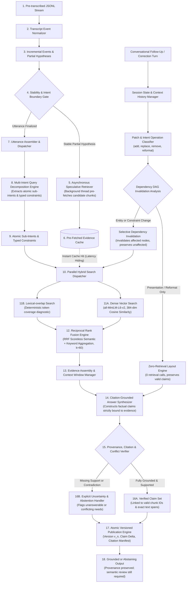

# FlowContext: Offline Streaming-Transcript RAG Prototype

[](https://www.python.org/downloads/release/python-3110/)
[](tests/)
[](LICENSE)
[](src/flowcontext/embeddings.py)
[](#)
[](#)
[](#real-llm--provider-integration-optional)

> ### Concept Summary: What FlowContext Does
> When speaking to a conventional AI assistant, the system waits until the user completely stops talking before initiating document retrieval and response generation—causing noticeable turn-taking latency. Furthermore, when the user provides a follow-up constraint or requests a reformat (*"summarize that as bullet points"*), typical systems discard previous computation and re-retrieve the entire corpus from scratch.
>
> **FlowContext is a bounded replay engine, not a complete voice product**:
> 1. **Processes transcript events**: Consumes pre-transcribed incremental or final JSONL events and can schedule speculative retrieval before an utterance finishes.
> 2. **Tracks follow-up state**: Uses bounded process-local session state to update affected factual claims and handle presentation-only turns.
> 3. **Fails closed on weak evidence**: Preserves provenance, rejects unsupported provider claims, and abstains when the available evidence is insufficient. Semantic entailment still requires governed review.

---

## Table of Contents

- [System Overview](#system-overview)
- [End-to-End System Architecture](#end-to-end-system-architecture)
- [System Capabilities & Verification Matrix](#system-capabilities--verification-matrix)
- [Core Architectural Pillars](#core-architectural-pillars)
  - [1. Streaming Ingestion & Speculative Latency Hiding](#1-streaming-ingestion--speculative-latency-hiding)
  - [2. Multi-Intent Decomposition & Hybrid RRF Search](#2-multi-intent-decomposition--hybrid-rrf-search)
  - [3. Dynamic Session State & Dependency Invalidation DAG](#3-dynamic-session-state--dependency-invalidation-dag)
  - [4. Grounded Synthesis & Provable Citation Verification](#4-grounded-synthesis--provable-citation-verification)
- [Quick Start & Setup](#quick-start--setup)
  - [Known Flaky Tests](#known-flaky-tests)
- [Real LLM / Provider Integration (Optional)](#real-llm--provider-integration-optional)
- [End-to-End Operational Workflows](#end-to-end-operational-workflows)
- [Conversational Replay Scenarios](#conversational-replay-scenarios)
- [CLI Reference](#cli-reference)
- [Repository Layout](#repository-layout)
- [Engineering Standards & Scientific Rigor](#engineering-standards--scientific-rigor)
- [License](#license)

---

## System Overview

Standard Retrieval-Augmented Generation (RAG) pipelines operate on a rigid sequential cycle: speech completes, full query parsing begins, corpus retrieval executes, and answer generation runs from zero. In conversational voice and live transcript applications, this sequential bottleneck introduces high latency, excessive token consumption, and context fragmentation.

**FlowContext** is an engineering prototype for the **Samsung PRISM Theme 4 (Live RAG)** concept. The repository implements the transcript replay, retrieval, generation, and session-state layers; audio capture, ASR, HTTP serving, UI, and production persistence are outside this codebase:

- **Speculative Latency Hiding**: Consumes incremental transcript events and issues bounded early retrieval queries on stable partial hypotheses.
- **Dense and lexical retrieval**: Supports pinned local dense embeddings plus a deterministic lexical-overlap diagnostic backend; the lexical backend is not BM25.
- **Fine-Grained Conversational Memory**: Tracks active entities and claims within a directed dependency graph (DAG), enabling selective re-retrieval when details change and instant zero-retrieval reformatting.
- **Verifiable Citation Grounding**: Publishes atomic, versioned answer records where each factual claim references exact document chunk spans, paired with explicit uncertainty handling whenever information is unanswerable.

---

## End-to-End System Architecture

FlowContext connects streaming transcript processing, speculative scheduling, hybrid retrieval, dependency invalidation, and grounded synthesis into a single unified top-to-bottom pipeline:


```mermaid
flowchart TD
    %% 1. Ingestion & Transcript Stream Layer
    In1["1. Pre-transcribed JSONL Stream"] --> In2["2. Transcript Event Normalizer"]
    In2 --> In3["3. Incremental Events & Partial Hypotheses"]
    
    %% 2. Stability & Speculative Fast Path
    In3 --> Gate1{"4. Stability & Intent Boundary Gate"}
    Gate1 -->|"Stable Partial Hypothesis"| Spec1["5. Asynchronous Speculative Retriever\n(Background thread pre-fetches candidate chunks)"]
    Spec1 --> Cache1[("6. Pre-Fetched Evidence Cache")]
    
    %% 3. Utterance Finalization & Decomposition
    Gate1 -->|"Utterance Finalized"| Decomp1["7. Utterance Assembler & Dispatcher"]
    Decomp1 --> Decomp2["8. Multi-Intent Query Decomposition Engine\n(Extracts atomic sub-intents & typed constraints)"]
    Decomp2 --> SubIntents["9. Atomic Sub-Intents & Typed Constraints"]
    
    %% 4. Conversational State & Dependency DAG
    FollowUp["Conversational Follow-Up / Correction Turn"] --> Sess1["Session State & Context History Manager"]
    Sess1 --> Patch1["Patch & Intent Operation Classifier\n(add, replace, remove, reformat)"]
    Patch1 --> DAG1{"Dependency DAG Invalidation Analysis"}
    DAG1 -->|"Presentation / Reformat Only"| ZeroRet["Zero-Retrieval Layout Engine\n(0 retrieval calls, preserves valid claims)"]
    DAG1 -->|"Entity or Constraint Change"| Inval1["Selective Dependency Invalidation\n(Invalidates affected nodes, preserves unaffected)"]
    
    %% 5. Parallel Hybrid Retrieval
    SubIntents --> RetDispatch["10. Parallel Hybrid Search Dispatcher"]
    Inval1 --> RetDispatch
    Cache1 -.->|"Instant Cache Hit (Latency Hiding)"| RetDispatch
    
    RetDispatch --> DenseSearch["11A. Dense Vector Search\n(all-MiniLM-L6-v2, 384-dim Cosine Similarity)"]
    RetDispatch --> LexSearch["11B. Lexical-overlap Search\n(Deterministic token coverage diagnostic)"]
    
    %% 6. Reciprocal Rank Fusion
    DenseSearch --> RRF["12. Reciprocal Rank Fusion Engine\n(RRF Scoreless Semantic + Keyword Aggregation, k=60)"]
    LexSearch --> RRF
    
    %% 7. Evidence Assembly & Grounded Synthesis
    RRF --> ContextAssy["13. Evidence Assembly & Context Window Manager"]
    ContextAssy --> Synth1["14. Citation-Grounded Answer Synthesizer\n(Constructs factual claims strictly bound to evidence)"]
    ZeroRet --> Synth1
    
    %% 8. Provenance & Contradiction Verification
    Synth1 --> VerifGate{"15. Provenance, Citation & Conflict Verifier"}
    VerifGate -->|"Fully Grounded & Supported"| ValidClaims["16A. Verified Claim Set\n(Linked to valid chunk IDs & exact text spans)"]
    VerifGate -->|"Missing Support or Contradiction"| UncertHandler["16B. Explicit Uncertainty & Abstention Handler\n(Flags unanswerable or conflicting needs)"]
    
    %% 9. Atomic Versioned Delivery
    ValidClaims --> Pub["17. Atomic Versioned Publication Engine\n(Version v_n, Claim Delta, Citation Manifest)"]
    UncertHandler --> Pub
    Pub --> FinalOut["18. Grounded or Abstaining Output\n(Provenance preserved; semantic review still required)"]
```

---

## System Capabilities & Verification Matrix

| Subsystem / Capability | Status | Architecture & Implementation Details | Verification Evidence |
|:---|:---:|:---|:---|
| **Deterministic Ingestion & Chunking** | `PASS` | SHA-256 fingerprinting, reproducible boundaries, structured JSONL schemas | [`src/flowcontext/ingestion.py`](src/flowcontext/ingestion.py) |
| **Lexical-overlap Retrieval** | `MEASURED**` | Deterministic unique-token coverage diagnostic; not BM25 | [`src/flowcontext/retrieval.py`](src/flowcontext/retrieval.py) |
| **Dense Vector Retrieval Smoke** | `MEASURED**` | Pinned `sentence-transformers/all-MiniLM-L6-v2` (384-dim); integrated live generation remains unverified | [`src/flowcontext/embeddings.py`](src/flowcontext/embeddings.py) |
| **Speculative Transcript Scheduler** | `PASS*` | Bounded replay scheduler with stale-event and race guards; audio/ASR are external | [`src/flowcontext/scheduler.py`](src/flowcontext/scheduler.py) |
| **Multi-Intent Decomposition** | `PASS` | Structural decomposition into independent sub-queries with typed constraints | [`src/flowcontext/multi_intent.py`](src/flowcontext/multi_intent.py) |
| **Reciprocal Rank Fusion (RRF)** | `PASS` | Rank aggregation combining dense and lexical candidate lists without arbitrary score weighting | [`src/flowcontext/multi_intent.py`](src/flowcontext/multi_intent.py) |
| **Stateful Selective Updates** | `PASS` | Process-local session tracking with dependency DAGs and surgical delta updates | [`src/flowcontext/phase4.py`](src/flowcontext/phase4.py) |
| **Zero-Retrieval Formatting Suppression** | `PASS` | Presentation-only changes retain verified factual claims with 0 retrieval calls | [`examples/replay/phase4-formatting.jsonl`](examples/replay/phase4-formatting.jsonl) |
| **Provenance-Grounded Synthesis** | `PASS` | Factual claim construction with strict chunk citation mapping and contradiction detection | [`src/flowcontext/synthesis.py`](src/flowcontext/synthesis.py) |
| **Explicit Uncertainty Quantification** | `PASS` | Targeted abstention and partial-support detection for incomplete evidence | [`src/flowcontext/synthesis.py`](src/flowcontext/synthesis.py) |
| **Real LLM & Provider Integration** | `NOT VERIFIED` | Generic OpenAI-compatible provider adapter exists; ships **disabled by default** (mock backend). Live credentials, provider compatibility, and integrated real-model generation require an external run — see [Real LLM / Provider Integration](#real-llm--provider-integration-optional) | [`src/flowcontext/generation.py`](src/flowcontext/generation.py) |
| **Automated Test Coverage** | `PASS***` | **155/158 tests pass deterministically**; 3 streaming-controller tests assert an async worker starts within a single event-loop tick and are timing-sensitive under host/filesystem load | [`tests/`](tests/) |

`*` Engineering-contract result on local replay fixtures. `**` Local measurement, not an official benchmark or semantic-quality claim. `***` See [Known Flaky Tests](#known-flaky-tests) for reproduction notes.

---

## Core Architectural Pillars

### 1. Streaming Ingestion & Speculative Latency Hiding

In interactive voice and transcript applications, human speech is emitted in partial bursts. FlowContext's streaming controller operates concurrently with the incoming transcript stream:

- **Early Speculative Trigger**: As soon as a stable intent boundary is detected (e.g., *"Which venue in Pune can host..."*), the scheduler initiates background retrieval asynchronously before the user completes the utterance.
- **Race Condition & Superseded Event Guards**: If the speaker changes direction mid-sentence (e.g., *"...no wait, in Mumbai"*), the controller cancels or supersedes in-flight retrieval requests, preventing race conditions and stale cache poisoning.
- **Deduplication & Coalescing**: Duplicate or overlapping sub-query requests within short sliding windows are coalesced into unified batch fetches.

### 2. Multi-Intent Decomposition & Hybrid RRF Search

Complex conversational requests frequently contain multiple overlapping constraints and comparisons (e.g., *"Find a conference hall for 40 people in Pune and list lunch packages under $30"*):

- **Structural Decomposition**: Syntactically decomposes complex sentences into atomic sub-intents with typed constraints (location, capacity, catering, amenities).
- **Parallel Multi-Backend Search**: Dispatches each sub-intent concurrently across dense semantic vector space (`sentence-transformers/all-MiniLM-L6-v2`) and the deterministic lexical-overlap diagnostic backend.
- **Reciprocal Rank Fusion (RRF)**: Fuses candidate lists using $RRF(d) = \sum_{m \in M} \frac{1}{k + r_m(d)}$ ($k=60$), delivering balanced retrieval robustness without requiring fragile manual score tuning.

### 3. Dynamic Session State & Dependency Invalidation DAG

In multi-turn conversations, re-retrieving the full corpus and regenerating entire answers from scratch for every follow-up turn wastes resources and disrupts conversational context:

- **In-Memory Session Graph**: Tracks conversational turns, active entities, published answer versions, and claim dependencies.
- **Patch Classification**: Classifies follow-up utterances into typed delta operations:
  - `add_constraint`: Adds an additional filter (e.g., *"Must include a projector"*).
  - `replace_constraint` / `entity_change`: Replaces a core attribute (e.g., *"Let's look at Venue B instead of Venue A"*).
  - `remove_constraint`: Relaxes an existing criterion.
  - `reformat_answer`: Presentation modification (e.g., *"Summarize that as bullet points"*).
- **Dependency DAG Invalidation**: When an entity or constraint changes, only the claims downstream of that entity in the dependency DAG are invalidated. Unaffected claims are preserved with their original citations. Presentation-only requests execute with **zero retrieval calls**.

### 4. Grounded Synthesis & Provable Citation Verification

FlowContext enforces strict factual grounding to eliminate conversational hallucination:

- **Atomic Answer Publication**: Emits immutable, versioned answer payloads ($v_1, v_2, \dots$) containing individual claims, supporting chunk IDs, and exact corpus text spans.
- **Strict Citation Tracking**: Every factual claim is validated against chunk IDs present in the active corpus.
- **Targeted Uncertainty**: When an information need cannot be resolved by retrieved evidence, FlowContext explicitly flags that specific sub-intent as unresolved rather than attempting speculative generation.

---

## Quick Start & Setup

### 1. Installation

FlowContext targets **Python 3.11** (3.12 also satisfies `requires-python`) and is managed with [`uv`](https://docs.astral.sh/uv/):

```bash
# Clone the repository
git clone https://github.com/Madhumasa84/Samsung_Prism.git
cd Samsung_Prism

# Install dependencies (CPU PyTorch + Sentence Transformers + Core RAG)
uv sync --locked --python 3.11 --extra dense
```

**Alternative (no `uv`):** if `uv` is unavailable, a plain `venv` + `pip` install works identically:

```bash
python3.11 -m venv .venv
# Windows: .venv\Scripts\python.exe -m pip install -e ".[dense]" pytest
.venv/bin/python -m pip install -e ".[dense]" pytest
```

Replace `uv run flowcontext ...` / `uv run pytest` below with `.venv/bin/flowcontext ...` / `.venv/bin/python -m pytest` (or the `.venv\Scripts\` equivalents on Windows).

### 2. Environment & Pipeline Verification

Run the automated validation and test suite:

```bash
# 1. Environment configuration check
uv run flowcontext config-check

# 2. Offline core pipeline smoke check (mock generation backend)
uv run flowcontext smoke

# 3. Dense vector embedding offline verification
# First run must omit --local-files-only so the pinned model can be
# downloaded once from Hugging Face and cached; subsequent runs can add
# --local-files-only to prove no network access is required.
uv run flowcontext dense-smoke
uv run flowcontext dense-smoke --local-files-only

# 4. Full pytest test suite (158 tests)
uv run pytest
```

#### Known Flaky Tests

Three tests in `tests/test_phase2.py` and `tests/test_streaming_evaluation.py` assert that the
async retrieval scheduler's background worker has observably *started* within a single
`asyncio.sleep(0)` event-loop tick (see `_wait_for_source_timing` in
[`src/flowcontext/replay.py`](src/flowcontext/replay.py) and the scheduler handoff in
[`src/flowcontext/streaming.py`](src/flowcontext/streaming.py)). Under a slow or heavily loaded
host (e.g. network filesystems, virtualized/WSL mounts, CI contention) that single tick is not
always enough time for the OS thread scheduler to run the worker, so these three tests can
intermittently fail (observed: 155/158 passing, with the 3 failures non-deterministic across
reruns). This is a test-timing limitation, not a functional defect in the retrieval or
correctness logic. Re-running just the affected tests in isolation is a reasonable local
workaround; a durable fix would replace the fixed one-tick yield with a bounded poll/wait for an
explicit "worker started" signal.

---

## Real LLM / Provider Integration (Optional)

**By default, FlowContext ships fully offline with a deterministic mock generation backend**
(`generation_provider: flowcontext.mock`). `flowcontext config-check` reports
`generation_api_key_configured: false` and `flowcontext smoke` reports `"backend": "mock"`
until this section is followed. No vendor-specific provider (Sarvam or otherwise) is
hard-coded anywhere in this repository — there is exactly one generation adapter, and it is a
generic **OpenAI-compatible** `/v1/chat/completions` client (see
[`src/flowcontext/generation.py`](src/flowcontext/generation.py)). Any provider that exposes
an OpenAI-compatible chat-completions endpoint (Sarvam included) can be wired in through that
same adapter — there is no separate Sarvam SDK or Sarvam-specific code path.

To point the generic adapter at a real provider, set the following environment variables
before invoking the CLI. **The API key variable name is configurable** — the app reads the key
from whichever environment variable `FLOWCONTEXT_GENERATION_API_KEY_ENV` names; it does not
hard-code `FLOWCONTEXT_GENERATION_API_KEY`, but that is the conventional default used below:

```bash
export FLOWCONTEXT_GENERATION_BACKEND=openai_compatible
export FLOWCONTEXT_GENERATION_PROVIDER=<provider-name>          # e.g. sarvam
export FLOWCONTEXT_GENERATION_MODEL=<model-name>                # e.g. sarvam-m
export FLOWCONTEXT_GENERATION_BASE_URL=https://<provider-endpoint>/v1
export FLOWCONTEXT_GENERATION_API_KEY_ENV=FLOWCONTEXT_GENERATION_API_KEY
export FLOWCONTEXT_GENERATION_API_KEY=<secret-in-process-environment-only>

uv run flowcontext evaluate-suite \
  --cases data/evaluation/development.jsonl \
  --split development \
  --corpus artifacts/fixture-lexical-index.json \
  --backend lexical \
  --execution-mode accelerated
```

The secret is read only from that process environment variable; it is never logged, persisted,
or included in trace/error output — only the *name* of the configured env var appears in
diagnostics. See [`docs/evaluation.md`](docs/evaluation.md#real-provider-verification) for the
full real-provider verification walkthrough and interpretation of `audit_status` /
`verification_status` / `release_status`. **No run in this repository's committed reports has
actually executed against a live provider** — the `Real LLM & Provider Integration` row in the
[Verification Matrix](#system-capabilities--verification-matrix) is intentionally marked
`NOT VERIFIED` until someone runs the steps above with real credentials and commits the
resulting report.

---

## End-to-End Operational Workflows

### Building Ingestion Indices

Construct deterministic lexical-overlap indices and optional dense vector embeddings from source documents:

```bash
# Build lexical-overlap diagnostic index
uv run flowcontext build-index \
  --input data/synthetic/documents.jsonl \
  --output artifacts/corpus-lexical-index.json \
  --backend lexical \
  --source-kind synthetic_fixture

# Query index directly
uv run flowcontext retrieve \
  --index artifacts/corpus-lexical-index.json \
  --source data/synthetic/documents.jsonl \
  --backend lexical \
  --query "Which venue in Pune accommodates 30 attendees?" \
  --top-k 3
```

### Running Streaming Speculative Replay

Replay incremental transcript events and compare baseline versus speculative execution:

```bash
# Baseline replay: waits for final utterance delivery
uv run flowcontext replay --mode baseline \
  --transcript examples/streaming/early-retrieval.jsonl \
  --index artifacts/corpus-lexical-index.json \
  --backend lexical \
  --execution-mode realtime --output artifacts/baseline.json

# Streaming speculative replay: triggers asynchronous early retrieval
uv run flowcontext replay --mode streaming \
  --transcript examples/streaming/early-retrieval.jsonl \
  --index artifacts/corpus-lexical-index.json \
  --backend lexical \
  --execution-mode realtime --output artifacts/streaming-replay.json
```

### Conversational Multi-Turn Session Replay

Replay multi-turn conversational interactions with surgical selective updating:

```bash
# Execute conversational replay with session state and selective invalidation
uv run flowcontext phase4-replay \
  --turns examples/replay/phase4-entity-correction.jsonl \
  --index artifacts/corpus-lexical-index.json \
  --output artifacts/session-trace.json

# Optional single-writer durable session snapshot
uv run flowcontext phase4-replay \
  --turns examples/replay/phase4-entity-correction.jsonl \
  --index artifacts/corpus-lexical-index.json \
  --session-store artifacts/phase4-sessions.json

# Resume that session in a later process with follow-up-only turns
uv run flowcontext phase4-replay \
  --turns examples/replay/phase4-resume-follow-up.jsonl \
  --index artifacts/corpus-lexical-index.json \
  --session-store artifacts/phase4-sessions.json --resume
```

Evaluation commands expose separate `audit_status`, `workflow_status`,
`verification_status`, and `release_status` fields. A local fixture can pass
its engineering invariants while still returning `PARTIAL` and exit code `2`
when official assets, semantic review, or a live provider are missing.

---

## Conversational Replay Scenarios

FlowContext includes end-to-end replay traces demonstrating distinct conversational situations:

| Interaction Scenario | Input Replay Script | System Behavior & Invalidation Strategy | Execution Trace |
|:---|:---|:---|:---|
| **Compound Multi-Need Query** | [`phase4-initial-compound.jsonl`](examples/replay/phase4-initial-compound.jsonl) | Decomposes compound venue and catering needs; publishes versioned answer $v_1$ | [`reports/phase4_replay_initial_compound.json`](reports/phase4_replay_initial_compound.json) |
| **Late Constraint Injection** | [`phase4-late-constraint.jsonl`](examples/replay/phase4-late-constraint.jsonl) | Surgically retrieves only for added constraint; preserves all existing factual claims | [`reports/phase4_replay_late_constraint.json`](reports/phase4_replay_late_constraint.json) |
| **Entity Correction** | [`phase4-entity-correction.jsonl`](examples/replay/phase4-entity-correction.jsonl) | Invalidates only dependent price/policy sub-branches of corrected entity | [`reports/phase4_replay_entity_correction.json`](reports/phase4_replay_entity_correction.json) |
| **Partial / Unsupported Turn** | [`phase4-partial-unsupported.jsonl`](examples/replay/phase4-partial-unsupported.jsonl) | Answers supported branch and explicitly flags unsupported needs with uncertainty | [`reports/phase4_replay_partial_unsupported.json`](reports/phase4_replay_partial_unsupported.json) |
| **Zero-Retrieval Formatting** | [`phase4-formatting.jsonl`](examples/replay/phase4-formatting.jsonl) | **0 retrieval calls**; updates presentation layout while retaining all citations | [`reports/phase4_replay_formatting.json`](reports/phase4_replay_formatting.json) |
| **Rapid Correction Race** | [`phase4-race.jsonl`](examples/replay/phase4-race.jsonl) | Cancels in-flight generation when user modifies speech before delivery | [`reports/phase4_replay_race.json`](reports/phase4_replay_race.json) |

---

## CLI Reference

FlowContext provides a unified command-line interface:

| Command | Subsystem | Description | Example Usage |
|:---|:---|:---|:---|
| `config-check` | Core | Validates environment variables and runtime settings | `flowcontext config-check` |
| `inspect-corpus` | Ingestion | Analyzes document structure, schemas, and token stats | `flowcontext inspect-corpus --input data.jsonl` |
| `build-index` | Indexing | Deterministically chunks and indices documents (dense/lexical) | `flowcontext build-index --input data.jsonl --output idx.json` |
| `retrieve` | Retrieval | Queries index using dense, lexical-overlap, or hybrid modes | `flowcontext retrieve --index idx.json --query "..."` |
| `replay` | Streaming | Executes streaming transcript replay (baseline vs streaming) | `flowcontext replay --transcript t.jsonl --mode streaming` |
| `phase4-replay` | Session | Replays multi-turn conversational follow-up sessions | `flowcontext phase4-replay --turns turns.jsonl` |
| `smoke` | Core | Executes full offline end-to-end integration check | `flowcontext smoke` |
| `dense-smoke` | Embeddings | Validates offline dense vector embedding generation | `flowcontext dense-smoke --local-files-only` |

---

## Repository Layout

```text
.
├── src/flowcontext/             # Core application package
│   ├── contracts.py             # Pydantic v2 schemas, event models & answer contracts
│   ├── config.py                # Environment and runtime settings management
│   ├── ingestion.py             # Deterministic chunking, SHA-256 hashing & index I/O
│   ├── indexing.py              # Index builder (dense, lexical, hybrid)
│   ├── embeddings.py            # SentenceTransformers wrapper and vector protocols
│   ├── retrieval.py             # Lexical-overlap & dense cosine similarity retrievers
│   ├── generation.py            # Structured grounded answer synthesis & repair loops
│   ├── scheduler.py             # Asynchronous speculative retrieval scheduler
│   ├── streaming.py             # Streaming transcript controller & stability rules
│   ├── multi_intent.py          # Structural query decomposition & RRF rank fusion
│   ├── synthesis.py             # Cross-intent evidence merging & uncertainty handling
│   ├── phase4.py                # Session store, patch classifier & dependency invalidation
│   ├── phase4_replay.py         # Multi-turn conversational replay engine
│   ├── phase4_evaluation.py     # Comprehensive matched evaluation harness
│   └── cli.py                   # Unified CLI entrypoints
├── data/
│   ├── synthetic/               # Synthetic corpus documents & transcripts (JSONL)
│   └── evaluation/              # Split-isolated evaluation cases & benchmarks
├── examples/
│   ├── streaming/               # Speculative streaming transcript scenarios
│   └── replay/                  # Multi-turn conversational replay scenarios
├── reports/                     # Machine-readable evaluation reports & execution traces
│   ├── phase4_evaluation.md     # Full-vs-selective evaluation report
│   ├── phase4_evaluation.json   # Machine-readable evaluation metrics
│   ├── phase4_evaluation_dense_test.md   # Dense retrieval evaluation report
│   ├── phase4_evaluation_dense_test.json # Dense retrieval evaluation metrics
│   ├── phase4_real_e2e.json     # Redacted real-backend attempt when configured
│   └── phase4_real_e2e_dense_test.json # Execution trace for integrated dense RAG
├── tests/                       # Complete unit, integration & regression test suite (158 tests)
├── docs/                        # Architecture deep-dives & subsystem specifications
│   ├── architecture-phase1.md   # Ingestion design & retrieval contracts
│   ├── architecture-phase3.md   # Multi-intent decomposition & RRF fusion
│   ├── architecture-phase4.md   # Dependency invalidation & selective updates
│   ├── phase5-handoff.md        # Production deployment roadmap & integration specifications
│   └── evaluation.md            # Evaluation methodologies & rubrics
├── pyproject.toml               # Package configuration, scripts & dependencies
└── LICENSE                      # MIT License
```

---

## Engineering Standards & Scientific Rigor

FlowContext is designed and built to rigorous software engineering and scientific standards:

1. **Deterministic Reproducibility**: Corpus chunking, SHA-256 fingerprinting, and retrieval scoring are completely deterministic. Given identical inputs, the pipeline produces identical indices and ranking scores.
2. **Strict Split Isolation**: Development and held-out evaluation scenarios are isolated in [`data/evaluation/`](data/evaluation/) with strict verification against cross-split data leakage.
3. **Robust Uncertainty Handling**: Unsupported provider claims are rejected at the application boundary; unresolved intents trigger explicit abstention or targeted clarification requests. This is not a proof of semantic zero hallucination.
4. **Security & Data Privacy**: Session state is bounded and local by default. API keys are read from environment variables and excluded from traces; persistence, retention, encryption, and deletion policy remain deployment responsibilities.

---

## License

This project is licensed under the [MIT License](LICENSE).
